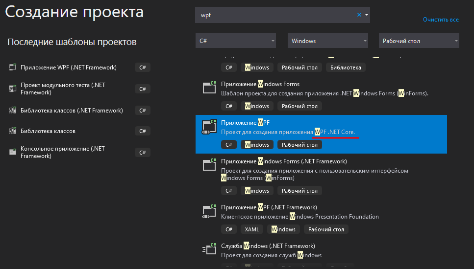
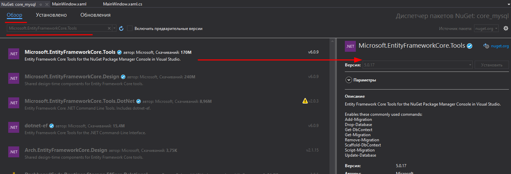
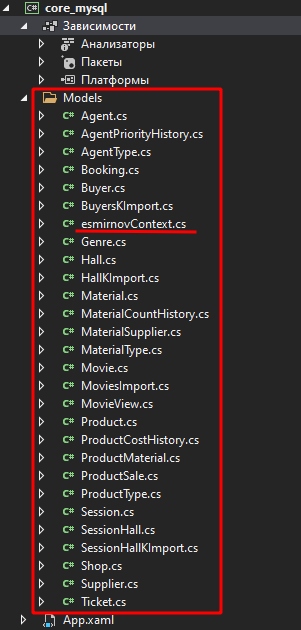
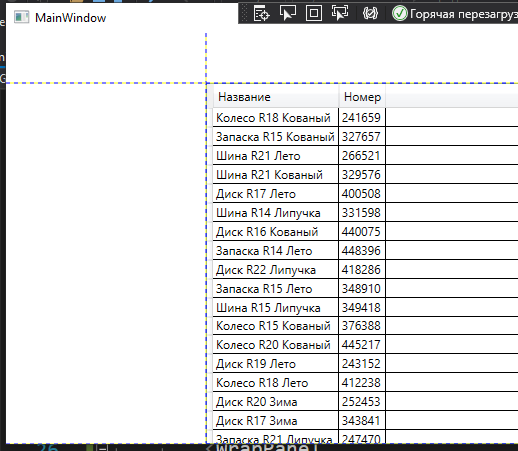

<table style="width: 100%;"><tr><td style="width: 40%;">
<a href="../articles/sql_import.md">Создание базы данных. Импорт данных.
</a></td><td style="width: 20%;">
<a href="../readme.md">Содержание
</a></td><td style="width: 40%;">
<a href="../articles/cs_layout.md">Вывод данных согласно макету (ListView, Image).
</a></td><tr></table>

* [Создание подключения к БД MySQL](#создание-подключения-к-бд-mysql)
* [Получение данных с сервера](#получение-данных-с-сервера)

Дальше мы продолжим разбор задания прошлогоднего демо-экзамена. 

Базу мы развернули и данные в неё импортировали, теперь начнём разбор второй сессии: создание desktop-приложения.

># Разработка desktop-приложений
>
>## Список продукции
>
>Необходимо реализовать вывод продукции, которая хранится в базе данных, согласно предоставленному макету (файл `product_list_layout.jpg` находится в ресурсах). При отсутствии изображения необходимо вывести картинку-заглушку из ресурсов (picture.png).
>
>
>
>...
>
>Стоимость продукта должна быть рассчитана исходя из используемых материалов.

# Создание подключения к БД MySQL.

По макету видно, что на первом экране уже нужны почти все данные, которые мы импортировали ранее: наименование продукта и артикул (таблица **Product**), тип продукта (**ProductType**), список материалов и стоимость материалов (**Material** через **ProductMaterial**).

Есть несколько вариантов работы с данными:

* ORM Фреймворки (библиотеки) - предпочтительный вариант, его мы и будем дальше использовать.

* Загрузака с помощью **DataAdapter** в наборы данных (**DataSet**). Для наборов данных можно даже установить связи между таблицами. Эта технология широко применялась в эпоху **Windows Forms** (этот способ рассматривался в [старых](./cs_mysql_connection.md#реализация-с-помощью-dataadapter) версиях лекций)

* Ещё один устаревший [вариант лекций](./cs_mysql_connection2.md) для **WPF** "заточен" на работу с объектами, в котором модели создавались вручную и данные в них грузились с помощью SQL-запросов и **DataReader**-a

**ORM** (Object-Relational Mapping, объектно-реляционное отображение) — технология программирования, суть которой заключается в создании «виртуальной объектной базы данных».

Благодаря этой технологии разработчики могут использовать язык программирования, с которым им удобно работать с базой данных, вместо написания операторов SQL или хранимых процедур. Это может значительно ускорить разработку приложений, особенно на начальном этапе. ORM также позволяет переключать приложение между различными реляционными базами данных. Например, приложение может быть переключено с MySQL на PostgreSQL с минимальными изменениями кода.

В прошлом году мы использовали **.NET Framework**, но с этого года перейдем на **.NET Core**.

**Во-первых**, **.NET Framework** работает только под ОС Windows и больше не поддерживается (последняя поддерживаемая версия C# - 4.7.2).

**Во-вторых**, ORM EntityFramewok не "дружит" с последними версиями MySQL коннектора

**.NET Core** - кроссплатформенная библиотека, поддерживает последние версии языка и ORM EntityFramewokCore.

Мы пока останемся на технологии **WPF**, т.е. ограничимся ОС Windows, но в перспективе перейдём и на Linux.

Итак, создадим проект на C#, для рабочего стола, WPF, **.NET Core**



В *целевой платформе* укажите **.NET 5.0** (для VSC 19 это последняя версия, для VSC 22 уже есть .NET 6)

В контекстном меню *зависимости* выберите "Управление пакетами NuGet" и установите пакеты "Microsoft.EntityFrameworkCore.Tools" и "Pomelo.EntityFrameworkCore.MySql"



Для подключения к базе данных нужно создать модели и контекст подключения (адрес сервера, название БД, логин и пароль). Тут есть два варианта:

1. **Application First** (сначала приложение) - в этом варианте модели и контекст подключения создаются руками в приложении, а **ORM** автоматически создает по ним одноимённые сущности в БД. (пример такого подхода расписан в [метаните](https://metanit.com/sharp/entityframeworkcore/7.2.php))

1. **DB First** (сначала база). В этом варианте база уже создана и нам нужен обратный процесс - [реконструировать](https://metanit.com/sharp/entityframeworkcore/1.3.php) модели и контекст по имеющейся БД. Мы будем использовать этот вариант.

В **Visual Studio** откройте окно: *Вид -> Другие окна -> Консоль диспетчера пакетов*. И выполните в ней команду (естественно, вписав свои базы и пароли):

```
Scaffold-DbContext "server=kolei.ru;database=esmirnov;uid=esmirnov;password=111103;" Pomelo.EntityFrameworkCore.MySql -OutputDir Models -f
```

Эта команда создает контекст подключения (параметры в кавычках) к провайдеру MySQL и модели сущностей в папке `Models` вашего проекта.



>Если вы хотите реконструировать не всю базу, а отдельные таблицы, то можно добавить параметр `-Tables`

# Получение данных с сервера.

Для демонстрации работы используем прошлогоднюю [заготовку](https://github.com/kolei/OAP/blob/master/articles/wpf_template.md) - вывод в DBGrid

* XAML

    ```xml
    <Grid ShowGridLines="True">
        <Grid.RowDefinitions>
            <RowDefinition Height="auto"/>
            <RowDefinition />
            <RowDefinition Height="auto"/>
        </Grid.RowDefinitions>
        <Grid.ColumnDefinitions>
            <ColumnDefinition Width="200"/>
            <ColumnDefinition/>
        </Grid.ColumnDefinitions>

        <StackPanel 
        Orientation="Vertical"
        Grid.RowSpan="3"
        VerticalAlignment="Bottom">
        </StackPanel>

        <WrapPanel
            Orientation="Horizontal"
            Grid.Column="1"
            MinHeight="50">
            <!-- минимальную высоту я тут поставил, чтобы верхнюю строку сетки было видно. В реальном приложении она не нужна -->
        </WrapPanel>

        <DataGrid
            Grid.Row="1"
            Grid.Column="1"
            CanUserAddRows="False"
            AutoGenerateColumns="False"
            ItemsSource="{Binding ProductList}">
            <DataGrid.Columns>
                <DataGridTextColumn
                    Header="Название"
                    Binding="{Binding Title}"/>
                <DataGridTextColumn
                    Header="Номер"
                    Binding="{Binding ArticleNumber}"/>
            </DataGrid.Columns>
        </DataGrid>
    </Grid>
    ```

* CS

    ```cs
    public partial class MainWindow : Window
    {
        public IEnumerable<Product> ProductList { get; set; }
        public MainWindow()
        {
            InitializeComponent();
            DataContext = this;
            using (var context = new esmirnovContext())
            {
                ProductList = context.Products.ToList();
            }
        }
    }
    ```

Всё работает!!!

