<table style="width: 100%;"><tr><td style="width: 40%;">
<a href="./android_tv.md">Android TV
</a></td><td style="width: 20%;">
<a href="../readme.md">Содержание
</a></td><td style="width: 40%;">
</a></td><tr></table>

# Разбор заданий прошлых лет

<!-- 
Задание 2021 года, 34 балла (6.8/13.6/23.8)
-->

Задание состоит из 3-х модулей:

1. **Модуль 1**  - разработка приложения для смартфона. Основное задание.
    - [Создание проекта](#создание-проекта)
    - [Заставка](#экран-launch-screen)
    - [Экран регистрации](#экран-регистрации)
        - [Валидация полей](#поля-для-ввода-валидируются-на-пустоту)
        - [Swagger](#запрос-регистрации-изучаем-работу-со-swagger)
        - [Регулярные выражения](#email-проверяется-на-удовлетворение-шаблону-из-задания-02-балла)
        - [Сохранение состояния](#при-первом-запуске-приложения-первым-отображается-signup-screen-при-последующих---signin-01-балла)
    - [Экран авторизации](#экран-авторизации)
    - [Главный экран](#главный-экран)
        - [Запрос подборки фильмов](#запрос-подборки-фильмов)
        - [Скруглённые углы у постера](#скруглённые-углы-у-постера)
        - [Переход между экранами](#переход-между-экранами)
    - [Экран "профиль пользователя"](#экран-профиль-пользователя)
        - [Запрос данных пользователя](#запрос-данных-пользователя)
        - [Изменение аватарки пользователя](#изменение-аватарки-пользователя)
            - [Выбор источника с помощью диалогового окна](#выбор-источника-камера-или-галерея-с-помощью-диалогового-окна)
            - [Открытие Галереи](#открытие-галереи)
            - [Отправка MultiPart запроса](#отправка-multipart-запроса)
            - [Обрезка аватарки по размеру контейнера](#обрезка-аватарки-по-размеру-контейнера)
            - [Кнопки "Обсуждения", "История", "Настройки" соответствуют макету](#кнопки-обсуждения-история-настройки-соответствуют-макету)
    - [Экран списка чатов пользователя (Chat List Screen)](#экран-списка-чатов-пользователя-chat-list-screen)
        - [Запрос списка чатов пользователя](#запрос-списка-чатов-пользователя)
        - [Запрос сообщений чата](#запрос-сообщений-чата)
        - [Отображение постера или аббревиатуры фильма](#отображение-постера-или-аббревиатуры-фильма)
        - [Вывод двух строк в TextView](#вывод-двух-строк-в-textview)
    - [Экран выбранного чата (Chat Screen)](#экран-выбранного-чата-chat-screen)
        - [Упорядочивание (сортировка) списка](#упорядочивание-сортировка-списка)
        - [Вывод даты перед группой сообщений](#вывод-даты-перед-группой-сообщений)
        - [Группировка сообщений пользователя](#группировка-сообщений-пользователя)
    - [Экран коллекций](#экран-коллекций)
        - [Хранение информация о коллекциях в памяти устройства](#хранение-информация-о-коллекциях-в-памяти-устройства)
        - [Список иконок плиткой](#список-иконок-плиткой)
    - [Экран создания коллекций](#экран-создания-коллекций)

1. **Модуль 2**  - разработка приложения для часов (может быть и для телевизора). Коротенькое задание (30 минут). Нужно просто создать приложение из двух окон + работа с интернетом.
    - [Создание проекта для часов](#модуль-2-умные-часы-разработка-приложения-для-управления-коллекцией-фильмов)

1. **Модуль 3**  - презентация.

## **Модуль 1**: Смартфоны (разработка мобильного приложения для управления коллекцией фильмов)

>Необходимо разработать мобильное приложение для смартфона, удовлетворяющее следующим требованиям:
>
>Приложение должно поддерживать следующие версии ОС:
>   * Android 9.0 и новее
>   * iOS 13.0 и новее

Задание универсальное, мы пишем для Android. Версия задаётся при создании проекта. По-умолчанию там стоит вообще для 5-го андроида. Установите по требованиям ТЗ:

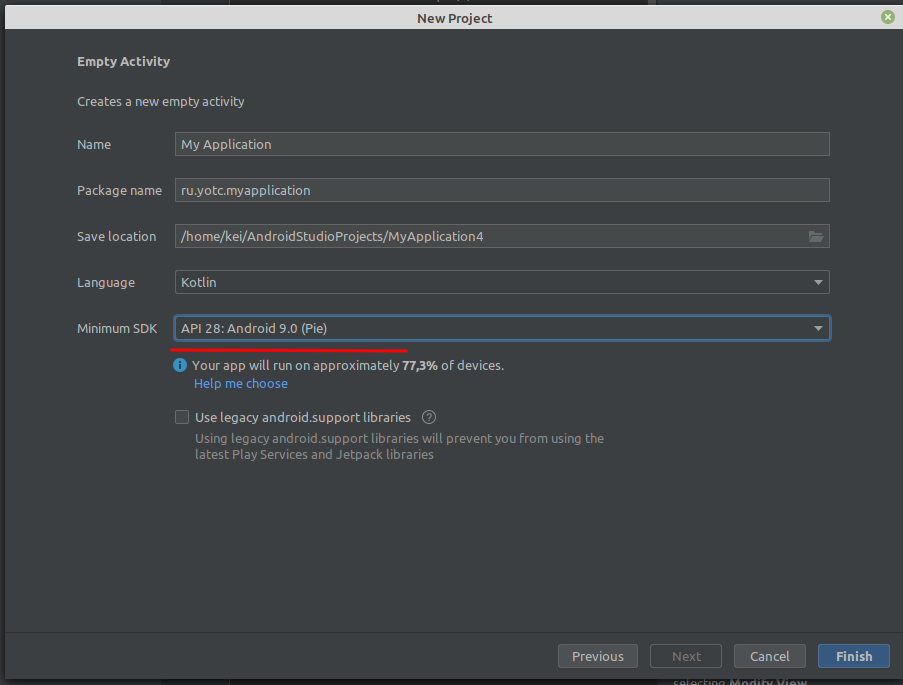

>В работе необходимо использовать систему контроля версий Git.
>
>Для входа используйте учетную запись вида wsX, где X – это номер участника. Необходимо загрузить результаты выполнения модуля в отдельную ветку с именем “Module-X”, где Х – это номер модуля. Для каждого проекта необходим отдельный репозиторий.

Критерий | Баллы
---------|:----:
Создан репозиторий для проекта | 0.25
Создана ветка для мобильного приложения | 0.35
Проект корректно сохранен в ветку для мобильного приложения и не требует дополнительного разархивирования | 0.45
**Итого** | 1.05

1. Название учётной записи будет **userXX**, но об этом я ещё упомяну перед экзаменом (у нас используется готовый сервер **Gogs** с предустановленными пользователями)
2. По веткам:

    *Я бы поменял знак тире на подчёркивание. Не известно как тире в командной строке сработает.*

    **Во-первых**, перед выполнением модуля сразу создайте соответствующий репозиторий (в этом задании названия репозиториев не оговорено): Module_1, Module_2, Module_3

    **Во-вторых**, создайте в репозитории ветку: `git checkout -b Module_1`

    **В-третьих**, при работе желательно в основной ветке (`Module_Х`) держать только **РАБОЧИЙ** код, чтобы было что оценивать не зависимо от того, на каком месте вы остановились. Для этого создайте ещё одну ветку, например **work** (`git checkout -b work`) и работайте в ней. После отладки какой-то фичи (например, сделали авторизацию) фиксируете изменения, переключаетесь на основную ветку (Module_1), сливаете ветки и заливаете основную ветку в репозиторий. Затем возвращаетесь в ветку **work**:

    * фиксируем изменения в ветке work

        ```
        git add .
        git commit -m "сделал авторизацию"
        ```

    * переключаемся на ветку Module_1

        ```
        git checkout Module_1
        ```

    * сливаем изменения из ветки work (в текущую) и, при желании, пушим на удаленный сервер

        ```
        git merge work
        git push origin Module_1
        ```

    * возвращаемся в рабочую ветку

        ```
        git checkout work
        ```

    итоговая структура репозиториев должна получиться примерно такая:

    * Module_1 (репозиторий)
        - Module_1 (ветка)
    * Module_2 (репозиторий)
        - Module_2 (ветка)
    * Module_3 (репозиторий)
        - Module_3 (ветка)

>Необходимо корректно обрабатывать запросы к серверу. В случае получения ошибки от сервера или отсутствия соединения с сетью Интернет необходимо отобразить соответствующий текст ошибки с помощью диалогового окна.

Тут вам придумывать ничего не надо - в классе **Http** уже есть пример, как перехватывать исключения

>Необходимо строго следовать предложенному дизайну. Макеты приложения доступны по ссылке:
https://www.figma.com/file/tD64TlCMQEqlr8OTv6bW2o/KOD1.4-Variant3?node-id=0%3A1 
>
>Описание протокола API доступно по ссылке: ~~https://app.swaggerhub.com/apis-docs/WorldSkills-MAD/WorldCinema/1.0.0~~ (так как АПИ на момент написания этих лекций не доступно, то я нарисовал своё АПИ и Swagger для него лежит [тут](http://swagger.kolei.ru?url=http://cinema.kolei.ru/swagger/cinema.yml))

>Проект приложения должен быть структурирован по экранам, то есть исходные файлы конкретного экрана должны быть в соответствующей папке. Общие для нескольких экранов классы необходимо поместить в папку common.

В андроиде нужно делать не папки, а пакеты. Например, создаёте пакет LaunchScreen и в него переносите MainActivity. Для остальных окон сначала делаете пакет, например SignUpScreen, затем в этом пакете создаёте SignUpActivity.

Критерий | Баллы
---------|:----:
Проект приложения для смартфона имеет корректную структуру (все файлы распределены по папкам, соответствующим экранам приложения) | 0.5

### Создание проекта

>Необходимо реализовать следующий функционал:
>
>1. Создайте проект. Настройте иконку приложения согласно макету. Следует учесть разницу в отображении иконок на различных версиях операционной системы.

Критерий | Баллы
---------|:----:
Создан проект мобильного приложения | 0.1
Проект мобильного приложения успешно собирается | 0.1
Иконка приложения соответствует Заданию | 0.2

Все ресурсы нужно получать из "фигмы"

**Как пользоваться "фигмой" для получения ресурсов:**

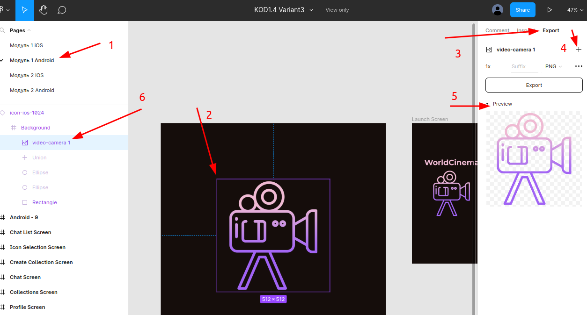

1. Убедитесь, что смотрите правильный вариант вёрстки (нам нужен Андроид, Модуль 1)
1. Экраны подписаны - нам нужен Icon-android (конкретно этот оказался не подписан)
    Выбираем элемент, который хотим экспортировать, например, иконку
1. В правой панели выберите закладку **Export**
1. Нажмите символ `+`, чтобы открыть настройки экспорта
1. Окройте **Preview** и убедитесь что элемент выбран весь целиком
1. Если в **Preview** видна только часть элемента, то в левой панели можно выбрать элемент выше по иерархии
1. Убедитесь, что формат для экспорта **PNG** и жмите **кнопку** Export

Браузер сохранит файл с тем же названием, что и у элемента вёрстки, например `Icon-android 512.png`). Переименуйте его, убрав пробелы, чёрточки и любую другую фигню, которая может помешать воспринимать ресурс по имени (оставьте только латинские буквы и цифры). Ещё, как выяснилось на практике, ресурсы не могут быть в **CamelCase**, при именовании не используйте большие буквы.

Про создание иконок смотри [первичную настройку приложения](./android_auth.md#первичная-настройка-приложения)

В этом задании используется тёмная тема. Для переключения в ночной режим в файле разметки в режиме "дизайна" установите соответствующий параметр.

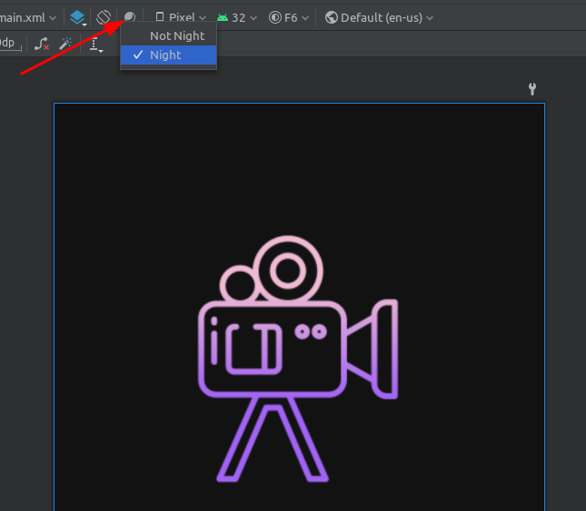

или в коде принудительно переключитесь в ночной режим:

```kt
AppCompatDelegate.setDefaultNightMode(AppCompatDelegate.MODE_NIGHT_YES)
```

### Экран Launch Screen

>2. Реализуйте экран Launch Screen согласно макету. Текст должен быть отдельным элементом. Логотип приложения должен быть расположен по центру экрана.

Критерий | Баллы
---------|:----:
Текст на Launch Screen является отдельным элементом | 0.1
Логотип на Launch Screen отцентрирован | 0.1

Экспортируйте необходимые файлы из "фигмы".

Перенесите (drag-n-drop) полученные файлы в ресурс *drawable* проекта


в шаблон окна добавьте элемент **ImageView** и отцентрируйте его горизонтально и вертикально (на этом окне можно не извращаться и не добавлять **LinearLayout**)


Аналогично экспортируйте и внедрите в ресурсы картинку с текстом *WorldCinema*.

Нигде в задании не сказано, как переходить на окно авторизации - добавьте таймер на несколько секунд, чтобы экперты успели рассмотреть вёрстку, и [переходите на следующее окно](../shpora/startActivity.md#таймер-обратного-отсчёта-и-переход-на-другое-activity)

### Экран регистрации


>3. Реализуйте экран SignUp Screen согласно макету:
>   * При нажатии на кнопку "Зарегистрироваться" необходимо проверять поля для ввода на пустоту, а также email на корректность (требования к email описаны в документации к API). При некорректном заполнении необходимо отобразить ошибку с помощью диалогового окна. Так же необходимо проверять равенство пароля и его повтора.
>   * При корректном заполнении формы необходимо отправлять запрос регистрации на сервер. При получении ошибки от сервера ее необходимо отобразить с помощью диалогового окна. При успешной регистрации нужно автоматически осуществить авторизацию и перейти на Main Screen.
>   * При нажатии на кнопку "У меня уже есть аккаунт" необходимо осуществлять переход на SignIn Screen.
>   * При первом запуске приложения после Launch Screen должен отображаться SignUp Screen. При последующих - SignIn Screen.

Критерий | Баллы
---------|:----:
Реализован запрос регистрации. Запрос фиксируется сервером | 0.7
Экран соответствует макету (оценивается верстка). Корректно реализованы 9 элементов: логотип, название, 5 текстовых полей, 2 кнопки (минус 0,1 за каждый отсутствующий или некорректный элемент) | 0.9
Поля для ввода валидируются на пустоту (минус 0,1 за каждое поле без валидации) | 0.5
Пароль и его повтор проверяются на равенство | 0.1
При получении ошибки от сервера она отображается с помощью диалогового окна | 0.3
Email проверяется на удовлетворение шаблону из Задания | 0.2
При первом запуске приложения первым отображается SignUp Screen, при последующих - SignIn | 0.1
**Итого** | **2.8**

Тут уже можно завернуть всё в **LinearLayout**

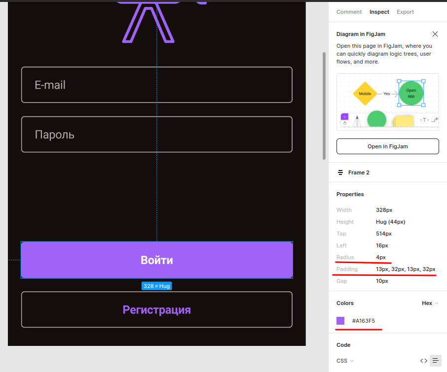

В панели свойств (правая панель) **фигмы** указаны параметры вёрстки выбранного элемента. В частности там указаны цвет элемента (нужен для кнопки), внутренние отступы (padding) и радиус границы.

### Поля для ввода валидируются на пустоту

Можно было бы использовать [специальный компонент](http://developer.alexanderklimov.ru/android/layout/textinputlayout.php) с маской ввода, но в задании сказано что валидация делается вручную при клике на кнопку "Зарегистрироваться". Пример ниже:

```kt
// обратите внимание на наименование переменных: самоочевидное название + тип элемента
lateinit var nameEditText: EditText
lateinit var signUpButton: Button

override fun onCreate(savedInstanceState: Bundle?) {
    super.onCreate(savedInstanceState)
    setContentView(R.layout.activity_main)

    // не забываем инициализировать ссылки на визуальные элементы
    nameEditText = findViewById(R.id.nameEditText)
    signUpButton = findViewById(R.id.signUpButton)

    signUpButton.setOnClickListener {
        try {
            if (nameEditText.text.isEmpty())
                throw Exception("Не заполнено имя пользователя")
            
            тут остальные проверки
            
            тут отправка запроса регистрации

        } catch (e: Exception) {
            // любую ошибку показываем на экране
            AlertDialog.Builder(this)
                .setTitle("Ошибка")
                .setMessage(e.message)
                .setPositiveButton("OK", null)
                .create()
                .show()
        }
    }
}
```

### Запрос регистрации (изучаем работу со Swagger)

**Swagger** - это фреймворк для спецификации *RESTful API*. Его прелесть заключается в том, что он дает возможность не только интерактивно просматривать спецификацию, но и отправлять запросы.

Открываем [ссылку](http://swagger.kolei.ru?url=http://cinema.kolei.ru/swagger/cinema.yml) на описание АПИ и смотрим что там есть:


В начале идёт общая информация. Нам тут пока интереснен только так называемый базовый URL. Здесь он находится в блоке Servers (`http://cinema.areas.su`), но может быть написан и просто текстом (как базовые урлы для картинок и видео).

**ВАЖНО!!!** *figma* и *swagger* на момент написания этой лекции работают, а вот сервер АПИ - нет, видимо его запускали только на время работы демо-экзамена. Я написал простенький симулятор этого сервера, он доступен по адресу `http://cinema.kolei.ru`.

Дальше идут описания методов АПИ. Рассмотрим подробно метод Регистрация:


1. В заголовке указано какой метод и "путь" используются для запроса. К пути надо добавить "базовый урл" и получим полный адрес запроса: `http://cinema.areas.su/auth/register`

1. В параметрах (Parameters) указываются параметры GET-запросов, передаваемые в строке запроса. У нас тут пусто.

1. Тело запроса (Request body). Тут указано что тело запроса обязательно должно присутсвовать (required) и формат `application/json`

    В теле запроса должна быть JSON-строка. Пример её можно посмотреть на вкладке **Example value**, но нам интереснее вкладка **schema** - на ней описаны типы данных (string), описание поля (что это такое вообще) и, возможно, обязательность использования поля. Например, для поля **email** расписан шаблон, которому оно должно соответсвовать.

1. Коды ответов (Responses)

    Тут надо быть внимательным, коды могут отличаться.

Ну и самое приятное в Swagger - можно прямо в нём проверить результат работы. Кликаем кнопку "Try it out", вводим в открывшемся окне тело запроса и нажимаем выполнить (Execute). Таким образом нам не нужны ни **Postman** ни **VSCode** с плагинами


Пример отправки запроса я не привожу - вы уже должны написать его самостоятельно.

### Email проверяется на удовлетворение шаблону из Задания (0.2 балла)

Такая проверка делается с помощью регулярных выражений. Например:

`^[a-z0-9]+@[a-z0-9]+\.[a-z]{1,3}$`

>В задании сказано, что имя и домен второго уровня должны содержать только маленькие буквы и цифры. 

* знак `^` означает "начало строки"
* Диапазон значений указывается в квадратных скобках. 
* Количество символов указывается после диапазона (`+` означает 1 и более)
* знак `@` пишем как есть
* точка является зарезервированным символом регулярных выражений (означает "любой символ"), поэтому её экранируем (перед точкой пишем обратный слеш)
* домен первого уровня должен содержать не более 3-х **букв** - задаем количество в фигурных скобках (от 1 до 3) и оставляем только буквы
* знак `$` означает "конец строки"

Пример проверки электронной почты:

```kt
val re = Regex("""^[a-z0-9]+@[a-z0-9]+\.[a-z]{1,3}$""")
val res = re.find(emailEditText.text.ToString())
// если регулярное выражение ничего не найдет, то вернёт null
if(res == null)
    throw Exception("Электронная почта не соответствует шаблону")
```

### При первом запуске приложения первым отображается SignUp Screen, при последующих - SignIn (0.1 балла)

Для того чтобы узнать первый запуск или нет, нужно сохранить этот признак в постоянное хранилище. Пример работы с хранилищем есть в [шпаргалке](../shpora/preferences.md). Попробуйте разобраться самостоятельно.

### При успешной регистрации нужно автоматически осуществить авторизацию и перейти на Main Screen.

При последовательном кодировании у вас получается слишком тяжёлая реализация (много вложенных вызовов - "callback hell")

* обработчик клика
    * проверки введённых данных
    * запрос регистрации
        * проверка результата
        * запрос авторизации
            * проверка результата
            * обработка исключений при проверке результата авторизации
        * обработка исключений при проверке результата регистрации
    * обработка исключений при проверке введённых данных

Чтобы избежать многократной вложенности, вспомним, что функцию обратного вызова мы можем объявить отдельно:

```kt
private fun showAlert(message: String) {
    runOnUiThread {
        AlertDialog.Builder(this)
            .setTitle("Ошибка")
            .setMessage(message)
            .setPositiveButton("OK", null)
            .create()
            .show()
    }
}

private val registrationCallback: (response: Response?, error: Exception?)->Unit = {
    response, error ->
    try {
        // тут проверка результата запроса и при необходимости запуск авторизации

    } catch (e: Exception) {
        // любую ошибку показываем на экране
        showAlert(e.message)
    }
}

private val authorisationCallback: (response: Response?, error: Exception?)->Unit = {
    response, error ->
    try {
        // тут проверка результата запроса и при необходимости переход на главное окно

    } catch (e: Exception) {
        // любую ошибку показываем на экране
        showAlert(e.message)
    }
}

// и обработчик кнопки "Регистрация" выглядит уже легче
registrationButton.setOnItemClickListener { parent, view, position, id ->
    try {
        // тут проверки полей

        Http.call(
            Http.buildRequest(
                "http://s4a.kolei.ru/login",
                json.toString()
            ),
            registrationCallback
        )
    } catch (e: Exception) {
        // любую ошибку показываем на экране
        showAlert(e.message)
    }
}
```

В итоге общая логика выглядит более структурированной:

* обработчик клика
    * проверки введённых данных
    * запрос регистрации
    * обработка исключений при проверке введённых данных
* callback регистрации
    * проверка результата
    * запрос авторизации
    * обработка исключений при проверке результата регистрации
* callback авторизации
    * проверка результата
    * запоминание токена
    * переход в основное окно (список фильмов)
    * обработка исключений при проверке результата авторизации

### Экран авторизации


>4. Реализуйте экран SignIn Screen согласно макету:
>   * При нажатии на кнопку "Войти" необходимо проверять поля для ввода на пустоту, а также email на корректность (требования к email описаны в документации к API). При некорректном заполнении необходимо отобразить ошибку с помощью диалогового окна. При корректном заполнении формы необходимо отправить на сервер соответствующий запрос.
>   * При нажатии на кнопку "Регистрация" необходимо осуществлять переход на SignUp Screen.
>   * При успешной авторизации необходимо осуществлять переход на экран Main Screen. При получении ошибки от сервера необходимо отобразить ее с помощью диалогового окна.

Критерий | Баллы
---------|:----:
Реализован запрос авторизации. Запрос фиксируется сервером | 0.7
При получении ошибки от сервера она отображается с помощью диалогового окна | 0.3
Экран соответствует макету (оценивается верстка). Корректно реализованы 6 элементов: логотип, название, 2 текстовых поля, 2 кнопки (минус 0,1 за каждый отсутствующий или некорректный элемент) | 0.6
Поля для ввода валидируются на пустоту (минус 0,1 за каждое поле без валидации) | 0.2
Email проверяется на удовлетворение шаблону из Задания | 0.3
**Итого** | **2.1**

Тут просто копипастите предыдущий экран, удалив лишнее, ничего нового.

Запрос тоже практически идентичный предыдущему, расписывать не буду.

Не забудьте сохранить полученный токен в [классе приложения](../shpora/%D1%85%D1%80%D0%B0%D0%BD%D0%B5%D0%BD%D0%B8%D0%B5%20%D0%B3%D0%BB%D0%BE%D0%B1%D0%B0%D0%BB%D1%8C%D0%BD%D1%8B%D1%85%20%D0%BF%D0%B5%D1%80%D0%B5%D0%BC%D0%B5%D0%BD%D0%BD%D1%8B%D1%85%20%D0%B2%20%D0%BA%D0%BB%D0%B0%D1%81%D1%81%D0%B5%20%D0%BF%D1%80%D0%B8%D0%BB%D0%BE%D0%B6%D0%B5%D0%BD%D0%B8%D1%8F.md) (и в предыдущем окне тоже)

### Главный экран


>5. Реализуйте экран Main Screen согласно макету:
>   * На экране необходимо отобразить обложки фильмов из подборки «new» (информацию о фильмах необходимо запрашивать с сервера). Обложки должны быть отображены в виде карусели, необходимо реализовать возможность пролистывания с помощью жеста swipe.
>   * При пролистывании обложек название фильма в верхней части экрана должно меняться.
>   * При нажатии на обложку необходимо переходить на Chat Screen для соответствующего фильма.

Критерий | Баллы
---------|:----:
Реализован запрос подборки фильмов. Запрос фиксируется сервером | 0.5
Обложки пролистываются с помощью swipe | 0.5
Обложка фильма отображается с закругленными углами | 0.3
При нажатии на обложку осуществляется переход на экран чата соответствующего фильма | 0.1
**Итого** | **1.4**

### Запрос подборки фильмов

В АПИ много лишних методов - ищете метод, который подходит по смыслу:

`GET /movies Получить список фильмов`

Так как метод запроса **GET**, то тела запроса (*body*) у него нет, но зато есть параметры запроса (*Parameters*), причём параметры эти обязательны (required).

Нам по заданию нужно отобразить новые (new), поэтому итоговый URL запроса будет такой:

`http://cinema.kolei.ru/movies?filter=new`

где:

- `http://cinema.kolei.ru` - базовый URL
- `/movies` - путь (*path*) запроса
- `?` - разделитель полного URL запроса и списка параметров
- `filter=new` - параметры запроса в формате `имя=значение`. Если необходимо передать несколько параметров, то они разделяются знаком `&`. Например: `?param1=one&param2=two`

Формат ответа - массив информации о фильмах. Нам, судя по вёрстке, нужны пока только название фильма (*name*) и обложка (*poster*). И, скорее всего, идентификатор (*movieId*), чтобы указать его в следующих запросах.

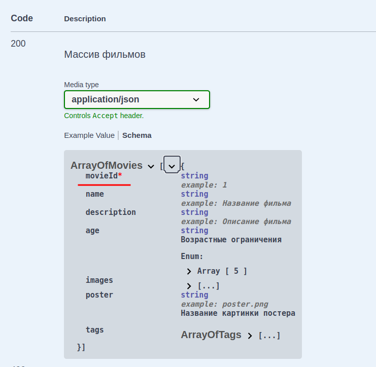

Обратите внимание на формат ответа, обязательным почему-то является только одно поле - *movieId*. Возможно это просто ошибка в формировании АПИ, но лучше всё-таки учесть такую вероятность и при отсутствии полей *name* или *poster* просто не добавлять такие элементы в список фильмов. 

Для вывода списка фильмов используйте компонент **RecyclerView** (направление пролистывания не указано, так что делайте как вам больше нравится)

### Скруглённые углы у постера

Есть вариант с программным изменением картинки, но он не учитывает последующую возможную обрезку картинки (понадобится при выводе аватарки). 

Есть более простой и наглядный вариант: элемент **ImageView** заворачивается в контейнер **androidx.cardview.widget.CardView**, которому и задаётся радиус:

```xml
<androidx.cardview.widget.CardView
    app:cardCornerRadius="100dp"
>

    <ImageView
        android:layout_width="match_parent"
        android:layout_height="match_parent"
    />
</androidx.cardview.widget.CardView>
```

### Переход между экранами


Для перехода между экранами внизу главного экрана есть панель навигации. Для её реализации есть отдельный механизм, который мы пока не рассматривали. Вы можете сюда поместить горизонтальный **LinearLayout**.

### Экран "профиль пользователя"

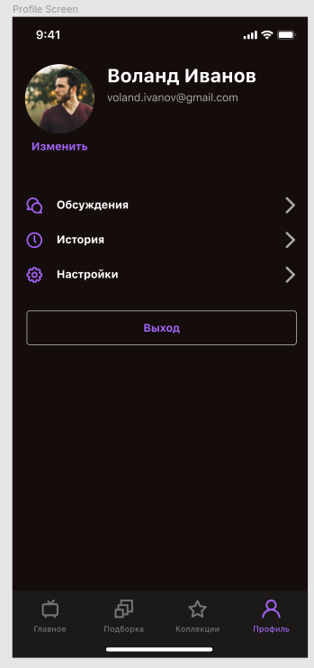


>6. Реализуйте экран Profile Screen согласно макету:
>   * Данные о пользователе необходимо запрашивать с сервера.
>   * При нажатии на кнопку "Изменить" необходимо реализовать изменение аватара пользователя: 
>       - Пользователь выбирает источник фотографии (камера или Галерея), выбор источника следует реализовать с помощью диалогового окна. При выборе Галереи необходимо открывать Галерею. При выборе камеры осуществлять переход на экран Камеры не нужно.
>       - Пользователь выбирает фотографию. 
>       - Фотография отправляется на сервер.
>       - В случае успеха аватар пользователя заменяется на новый, в случае ошибки она отображается с помощью диалогового окна.
>   * При нажатии на кнопку "Выход" необходимо осуществлять переход на экран авторизации. 
>   * При нажатии на кнопку «Обсуждения» необходимо переходить на соответствующий экран.

Критерий | Баллы
---------|:----:
Изображения отображаются без искажений | 0.1
Радиус скругления углов кнопки "Выход" соответствует макету | 0.1
Реализован запрос информации о пользователе. Запрос фиксируется сервером | 0.5
Реализована отправка аватара. Запрос фиксируется сервером | 1
При получении ошибки от сервера она отображается | 0.3
Аватар пользователя обрезается | 0.2
Аватар пользователя загружается с сервера | 0.2
Кнопки "Обсуждения", "История", "Настройки" соответствуют макету оценивается верстка): для каждой кнопки иконка, заголовок, стрелка (минус 0,2 за каждый отсутствующий, неполный или некорректный элемент) | 0.6
Реализован выбор источника фотографии | 0.2
**Итого** | 3.2

### Запрос данных пользователя


Если предыдущие запросы были доступны всем, то этот запрос может делать только авторизованный пользователь. 

Для того, чтобы запрос был авторизованным, нужно в заголовок запроса добавить параметр *Authorization*, как описано в начале документа.

Напоминаю синтаксис добавления заголовка в классе **http**:

```kt
Http.call(
    Http.buildRequest(
        "http://cinema.kolei.ru/user",
        headers = mapOf("Authorization" to "Bearer ${app.token}")
    ),
    userCallback
)
```

Успешный запрос вернёт **массив** объектов (с одним элементом, естественно), учитываёте при разборе JSON.

Чтобы протестировать этот запрос в **swagger**-e, нужно получить токен авторизации запросом **/auth/login**, затем кликнуть кнопку **Authorize** на окне выше и ввести токен в поле **Value**:

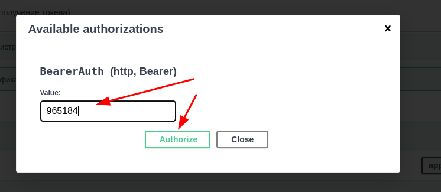

Иконка замка сменится на "закрыто". После этого можно выполнять запросы, требующие авторизации.

В ответ на запрос информации о пользователе придёт что-то подобное:

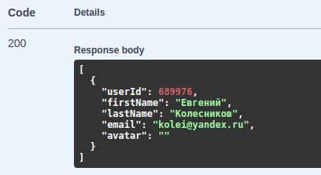

### Изменение аватарки пользователя

#### Выбор источника (камера или галерея) с помощью диалогового окна

С диалоговыми окнами мы уже знакомы (мы их используем для вывода текста ошибок). У класса **AlertDialog** есть метод, позволяющий сделать выбор из массива:

```kt
// сначала объявляем массив строк для выбора
val choiceItems = arrayOf("Галерея","Камера")

// создаём и показываваем диалог
AlertDialog.Builder(this)
    .setTitle("Выберите источник")
    .setNegativeButton("Отмена", null)
    .setSingleChoiceItems(choiceItems, -1){
        dialog, index ->
        Toast.makeText(this, "$index", Toast.LENGTH_LONG).show()
        dialog.dismiss()
    }
    .create()
    .show()
```

При создании диалога добавился вызов метода *setSingleChoiceItems*, который как раз и задаёт массив элементов для выбора. **Первым** параметром этого метода задаётся массив **строк**, **вторым** - активный по-умолчанию элемент (можно указать `-1`, если не нужно выбирать что-то по-умолчанию) и **третьим** параметром задаётся лямбда функция, которая вызывается при выборе элемента списка. 

В лямбда функцию передаётся два параметра: 
* *dialog* - указатель на экземпляр диалога
* *index* - позиция выбранного элемента в массиве

Я в примере выше просто вывожу на экран номер выбранного элемента и закрываю диалог (*dialog.dismiss()*). Вам нужно в зависимости от выбранного элемента либо показать Галерею, либо открыть приложение Камера (можно прямо тут, но можно и выделить в отдельную лямбда функцию).

#### Открытие Галереи

Открытие внешних программ (активностей) осуществляется тем же вызовом класса **Intent**. Только в параметрах мы должны передавать не контекст (*this*), а тип нужной нам активности.

Для получения каких-то данных используется тип **Intent.ACTION_PICK**.

Для конкретизации типа данных указывается свойство *type*

Для открытия активности, которая может вернуть список картинок:

```kt
// константа для анализа результата объявляется на уровне класса
val GALLERY_REQUEST = 1

val photoPickerIntent = Intent(Intent.ACTION_PICK)
// фильтр
photoPickerIntent.type = "image/jpg"

//запускаем запрос, указав что ждём результат 
startActivityForResult(photoPickerIntent, GALLERY_REQUEST)
```

Получение результата от активности мы уже разбирали, когда делали выбор города в проекте "погода". Обработчик результата всего один для класса активности. Поэтому при запуске активности мы и передаём уникальный номер запроса, чтобы при разборке ответа знать от кого он пришёл:

```kt
override fun onActivityResult(
    requestCode: Int, 
    resultCode: Int, 
    intent: Intent?) 
{
    // проверяем код запроса
    if (requestCode == GALLERY_REQUEST) {
        // убеждаемся что выполнено успешно (пользователь мог ничего и не выбрать в галерее)
        if (resultCode == Activity.RESULT_OK  && intent != null) {
            // галерея возвращает URI картинки в свойстве data параметра intent
            sendFile(intent.data!!)
        }
    }
}
```

#### Отправка MultiPart запроса 

>Класс **StreamHelper**, используемый при получении файла, лежит в [шпаргалках](../shpora/StreamHelper.kt)

```kt
private fun sendFile(fileUri: Uri) {
    // получаем из Uri файла указатель на поток данных
    val fileStream = contentResolver
        .openInputStream(fileUri)

    // получаем файл
    val fileBody: RequestBody = StreamHelper
        .create(
            "image/jpg".toMediaType(), 
            fileStream!!)

    val requestBody = MultipartBody.Builder()
        .setType(MultipartBody.FORM)
        .addFormDataPart("token", app.token)
        .addFormDataPart(
            "file", // название части запроса
            "filename.jpg", // имя файла
            fileBody    // тело файла
        )
        .build()

    val request = Request.Builder()
        .url("http://cinema.kolei.ru/user/avatar")
        .post(requestBody)
        .build()

    Http.call(request) { response, error ->
        try {
            if (error != null) throw error
            if (!response!!.isSuccessful) 
                throw Exception(response.message)

            // всё ОК
            runOnUiThread {
                /* при успешной отправке меняем аватарку 
                (ImageView в вашей активности)*/
                avatarImageView.setImageURI( fileUri )
            }
        } catch (e: Exception) {
            showAlert(e.message!!)
        }
    }
}
```

### Обрезка аватарки по размеру контейнера

При выборе файла из галереи пропорции будут скорее всего не одинаковые, поэтому при отображении вы должны задать как отображается изображение:

```xml
<ImageView
    android:layout_width="88dp"
    android:layout_height="88dp"
    android:adjustViewBounds="true"
    android:scaleType="centerCrop"
```

Параметр `android:adjustViewBounds="true"` включает масштабирование, а параметр `android:scaleType` указывает тип масштабирования. Вариантов масштабирования несколько, вы можете посмотреть на практике как они влияют на результат. Но нам нужен *centerCrop*, означающий, что картинка будет центрироваться, а то, что не помещается отрежется.

### Кнопки "Обсуждения", "История", "Настройки" соответствуют макету

Тут всё просто: в горизонтальный **LinearLayout** помещаете три элемента, как в вёрстке, задаёте этому **LinearLayout**-у тег `id` и событие *setOnClickListener* "вешаете" на **LinearLayout**. (Событие *setOnClickListener* объявлено в базовом классе **View**, от которого наследуются все визуальные элементы)

### Экран списка чатов (Chat List Screen)

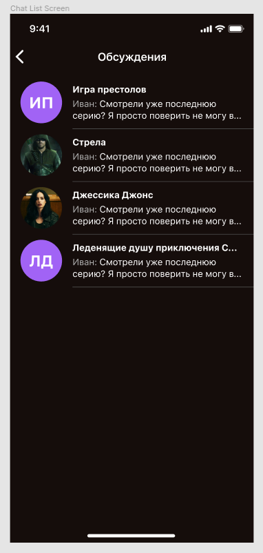

>7. Реализуйте экран Chat List Screen согласно макету:
>   * Информацию необходимо запрашивать с сервера (запрос чатов пользователя). Если информация с сервера содержит дубляжи – их необходимо удалить. Если ваш пользователь еще не имеет чатов, сервер присылает пустой список, отправьте сообщение от текущего пользователя в чате с id = 1 с помощью Swagger или Postman.
>   * В подзаголовке ячейки необходимо отобразить последнее сообщение в соответствующем чате + имя его автора. Текст сообщения необходимо обрезать до двух строк.
>   * Реализуйте отображение постеров к фильмам. Для получения постеров используйте подходящий запрос из API. Если постер для данного фильма нельзя получить из API - сгенерируйте абревиатуру по следующему правилу: если название фильма состоит и одного слова - необходимо взять первые две буквы слова; иначе - первые буквы первого и второго слова.
>   * При нажатии на ячейку необходимо осуществлять переход на Chat Screen для выбранного фильма.

Критерий | Баллы
---------|:----:
Реализован запрос списка чатов пользователя | 0.5
Реализован запрос сообщений чата | 0.5
Ячейка таблицы соответствует макету (оценивается верстка).Корректно реализованы 3 элемента: изображение, название, подзаголовок (минус 0,1 за каждый отсутствующий или некорректный элемент). | 0.3
В подзаголовке отображается последнее сообщение для данного чата | 0.2
Текст сообщения обрезается до двух строк | 0.2
Реализовано отображение аббревиатуры согласно Заданию | 0.3
**Итого** | 2

### Запрос списка чатов **фильма**

>АПИ, на мой взгляд, реализовано кривовато, не понятно как попадать в список чатов **пользователя**, я переделал АПИ так, чтобы вы реализовали список чатов фильма, кликнув по его постеру

`GET /chats/{movieId}`

Нужно учитывать, что запрос требует указания идентификатора выбранного фильма, а в остальном ничего особенного. 

>Учитывая, что в информации о чате мы должны показать последнее сообщение из чата, в дата класс надо добавить и свойство для этого сообщения

```kt
data class Chat(
    // данные из списка чатов
    chatId: String,
    movieId: String,
    name: String,

    // дополнительные данные
    avatar: String? = null,     // имя файла
    lastMessage: String? = null // текст последнего сообщения
)
```

И после заполнения списка чатов пробежаться по нему в цикле и запросить/заполнить недостающие данные.

При отображении дополнительных данных в **RecycleView** учитывайте, что они ещё могут быть **null**:

```kt
someTextView.text = item[position].lastMessage? ?: ""
if (item[position].avatar != null) {
    // запросить файл у сервера
}
```

### Запрос сообщений чата

В информации о чате мы должны показать последнее сообщение этого чата, поэтому после получения списка чатов мы должны по каждому из них запросить и список сообщений этого чата. Последнее сообщение (тут желательно сделать проверку по дате) этого списка вписать в элемент списка чатов (ищем по Id чата)

`GET /chats/{chatId}/messages`

### Отображение постера или аббревиатуры фильма

Для вывода постера нужно иметь список фильмов. Можно запросить его ещё раз, а можно в главном окне хранение фильмов сделать не в свойствах класса активности, а в свойствах класса приложения (там, где вы храните токен)

Для переключения типа аватарки фото/аббревиатура можно применить такую вёрстку:

```xml
<androidx.cardview.widget.CardView
    android:layout_width="100dp"
    android:layout_height="match_parent"
    app:cardCornerRadius="50dp"
    >
    <FrameLayout
        android:layout_width="match_parent"
        android:layout_height="match_parent">
        <TextView
            android:layout_width="match_parent"
            android:layout_height="match_parent"
            android:background="#fee"
            android:textSize="50dp"
            android:gravity="center"
            android:text="НФ"
            android:visibility="visible"
            />
        <ImageView
            android:layout_width="match_parent"
            android:layout_height="match_parent"
            android:src="@drawable/videocamera2"
            android:visibility="gone"
            />
    </FrameLayout>
</androidx.cardview.widget.CardView>
```

**CardView** задаёт форму и размер, **FrameLayout** позволит выводить и текст и изображение в одном месте, а атрибутом *visibility* включается/выключается нужный элемент. 

Текст в **TextView**, надеюсь, напишете сами

### Вывод двух строк в TextView

Просто добавить атрибут *lines*:

```xml
<TextView
    android:lines="2"
    ...
```        

### Выход из экрана

По клику на стрелку влево (в верхней строке окна) вызвать метод *finish()* активности.

### Вывод всех чатов

Переход из окна профиля по клику на "Обсуждения". 

Метод для получения списка всех чатов: `GET /user/chats`

Activity используйте эту же самую

### Экран выбранного чата (Chat Screen)

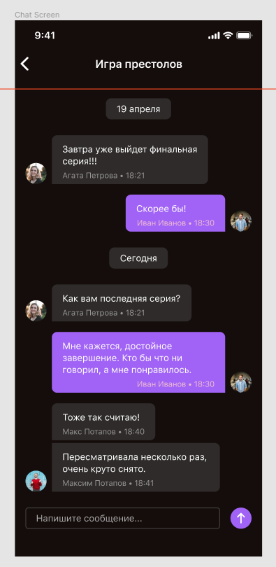

>8. Реализуйте экран Chat Screen согласно макету:
>   * Сообщения необходимо упорядочить от старых к новым сверху вниз. Для сегодняшних сообщений необходимо отобразить заголовок "Сегодня".
>   * "Облако" сообщения должно растягиваться по содержимому.
>   * Последовательно идущие сообщения одного автора необходимо группировать (расстояния между сообщениями должны быть меньше, как на макете).
>   * Реализуйте блок отправки сообщения как на макете. При вводе сообщения поле для ввода должно растягиваться по вертикали.
>   * При нажатии на кнопку "Отправить" необходимо отправить сообщение на сервер. При позитивном ответе от сервера необходимо отобразить сообщение в чате. При возникновении ошибки - отобразить ошибку с помощью диалогового окна.
>   * Необходимо валидировать поле для ввода на пустоту. При отсутствии текста сообщения необходимо отобразить ошибку с помощью диалогового окна.

Критерий | Баллы
---------|:----:
Реализован запрос сообщений чата | 0.5
Реализована отправка сообщения в чат | 0.7
Отображение сообщения соответствует макету (оценивается верстка). Корректно реализованы 3 элемента: аватар, текст, подзаголовок (минус 0,1 за каждый отсутствующий или некорректный элемент) | 0.3
Сообщения упорядочены согласно Конкурсному Заданию | 0.3
"Облако" сообщения растягивается по содержимому без искажений радиуса скругления углов | 0.4
Отображение последовательно идущих сообщений одного автора соответствует макету (расстояния между сообщениями меньше) | 0.4
Поле для ввода растягивается при добавлении текста | 0.4
При получении ошибки от сервера она отображается с помощью диалогового окна | 0.3
При попытке отправить пустое сообщение отображается ошибка с помощью диалогового окна | 0.3
**Итого** | 3.6

Как получить список сообщений мы уже разбирали в прошлой лекции.

### Упорядочивание (сортировка) списка

>Для того, чтобы массив объектов (экземпляров какого-либо класса) можно было сортировать **по сложному условию**, класс должен реализовывать интерфейс **Comparable** и переопределить метод *compareTo*:
>
>```kt
>data class ChatMessage(
>    val chatId: String,
>    val messageId: String,
>    val creationDateTime: LocalDateTime
>    // тут остальные поля
>    ): Comparable<ChatMessage>
>{
>    override fun compareTo(other: ChatMessage): Int {
>        return if(other.creationDateTime > this.creationDateTime) 1 else -1
>    }
>}
>
>...
>
>// после заполнения списка сообщений просто вызвать метод sort()
>chatMessageList.sort()
>```

Для сравнения простых свойств есть вариант проще:

```kt
chatMessageList.sortBy(
    item -> item.creationDateTime)

chatMessageList.sortByDescending(
    item -> item.creationDateTime)
```

### Вывод даты перед группой сообщений

1. В вёрстке элемента сообщения должен быть элемент для даты
2. В адаптере **RecyclerView** сравнивать дату текущего сообщения с датой предыдущего (учитывайте, что предыдущего может не быть). Если дата отличается, то выводим дату, если не отличатется, то скрываем элемент даты (`visible = View.GONE`)

### Группировка сообщений пользователя

В принципе тоже самое что и с датой, только менять верхнюю границу сообщения

```kt
// считываем текущие параметры разметки элемента
val param = messageTextView.layoutParams as ViewGroup.MarginLayoutParams

// устанавливаем нужную границу
param.setMargins(10,10,10,10)

// применяем изменившиеся параметры к элементу
messageTextView.layoutParams = param
```

### Экран коллекций

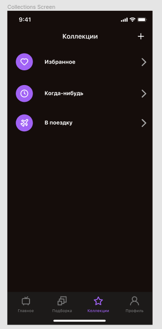

>9. Реализуйте экран Collections Screen согласно макету:
>   * При нажатии на иконку в правом верхнем углу необходимо переходить на экран Create Collection Screen.
>   * На экране необходимо отображать созданные коллекции. **Информация о коллекциях должна храниться в памяти устройства**. Необходимо хранить название коллекции и иконку.
>   * Реализуйте Swipe-to-delete для удаления коллекции, в том числе из памяти устройства.

Критерий | Баллы
---------|:----:
Ячейка коллекции соответствует макету (оценивается верстка). Корректно реализованы 3 элемента: иконка, название, стрелка (минус 0,1 за каждый отсутствующий или некорректный элемент) | 0.3
Реализована возможность удаления коллекции с помощью swipe-to-delete | 0.3
**Итог** | 0.6

Так как реализовывать фичи надо атомарно, то желательно завершить реализацию этого экрана, прежде чем делать следующие.

### Хранение информация о коллекциях в памяти устройства

Вспоминаем метод *getSharedPreferences* - список коллекций можно хранить JSON-строкой (напоминаю, что хранилище оперирует только скалярными типами). В качестве идентификатора иконки использовать `id` ресурса.

Чтобы иметь идентификаторы ресурсов иконок создадим массив ресурсов (естественно эти ресурсы должны быть в проекте). Можно его объявить локально, но нам он понадобится ещё на одном экране - выбор иконки для создания коллекций, поэтому ~~вынесем его в ресурсы~~ (выковыривание из ресурсов  получилось слишком трудоёмким, этот вариант правильный, но использовать будем другой):

>* в каталоге `res/values` создайте файл ресурсов (*New -> Values Resource File*) и опишите в нём массив ресурсов:
>
>    ```xml
>    <?xml version="1.0" encoding="utf-8"?>
>    <resources>
>        <integer-array name="icons">
>            <item>@drawable/ico1</item>
>            <item>@drawable/ico2</item>
>            <item>@drawable/ico3</item>
>            <item>@drawable/ico4</item>
>            <item>@drawable/ico5</item>
>            <item>@drawable/ico6</item>
>            <item>@drawable/ico7</item>
>            <item>@drawable/ico8</item>
>            <item>@drawable/ico9</item>
>        </integer-array>
>    </resources>
>    ```
>
>   Причём Android Studio достаточно умный, чтобы показать нам содержимое массива
>    
>    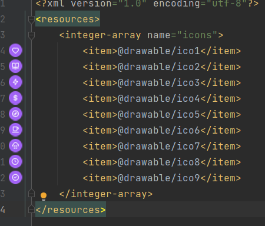
>
>* в классе активности получим массив из ресурсов:
>
>   ```kt
>   // массив идентификаторов объявлен на уровне класса
>   private var iconArray = arrayListOf<Int>()
>
>   // в конструкторе считываем массив из ресурсов и преобразуем его в массив идентификаторов...
>   val typedArray = resources.obtainTypedArray(R.array.icons)
>   for(i in 0 until typedArray.length()){
>   iconArray.add( typedArray.getResourceId(i, 0) )
>   }
>   typedArray.recycle()
>   ```

Реализация через ресурсы получается достаточно сложной, проще этот массив объявить в классе приложения (MyApp):

```kt
val iconArray = arrayOf(
    R.drawable.ico1, 
    R.drawable.ico2, 
    R.drawable.ico3, 
    R.drawable.ico4, 
    R.drawable.ico5,
    R.drawable.ico6, 
    R.drawable.ico7, 
    R.drawable.ico8, 
    R.drawable.ico9
)
```

Как быть, если у нас ещё нет сохраненного списка коллекций?

При получении списка коллекций, в качестве значения по-умолчанию, вернём JSON-строку, где `id` зададим первый элемент массива ресурсов:

```kt
val collectionsString = myPreferences.getString(
    "collections",
    """[{"id":${iconArray[0]},"name":"Первый список"}]"""
)
```

Преобразовать полученную JSON-строку в массив и сделать RecyclerView вы уже можете сами.

### Удаление свайпом с подтверждением

В констуктор, после создания адаптера для RecyclerView добавьте отслеживание свайпа:

```kt
val simpleCallback = object :
    ItemTouchHelper.SimpleCallback(0, ItemTouchHelper.LEFT) {
    override fun onMove(
        recyclerView: RecyclerView,
        viewHolder: RecyclerView.ViewHolder,
        target: RecyclerView.ViewHolder
    ): Boolean = false

    override fun onSwiped(viewHolder: RecyclerView.ViewHolder, direction: Int) {
        deleteItem(viewHolder.adapterPosition)
    }
}

val itemTouchHelper = ItemTouchHelper(simpleCallback)
itemTouchHelper.attachToRecyclerView(collectionsRecycleView)
```

И в классе определить метод *deleteItem*:

```kt
fun deleteItem(position: Int){
    // удаляем элемент из списка коллекций
    collectionList.removeAt(position)

    // обновляем RecyclerView
    collectionsRecycleView.adapter?.notifyDataSetChanged()

    // самостоятельно сформируйте JSON-массив оставшихся коллекций и сохраните его в preferences
}
```

### Экран создания коллекций

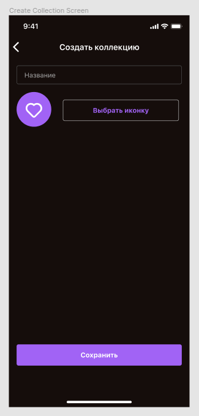
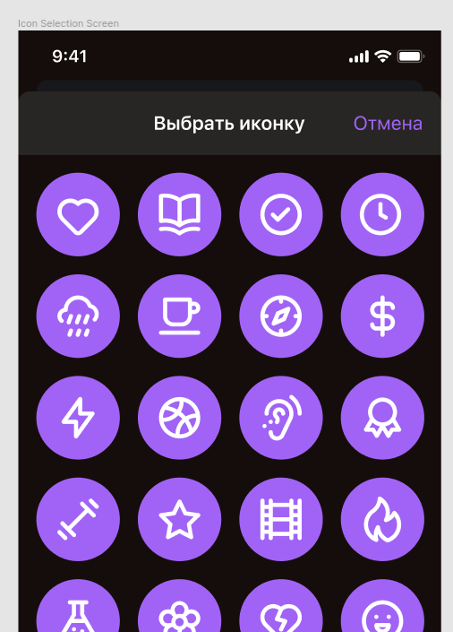

>10. Реализуйте экран Create Collection Screen согласно макету:
>   * При открытии экрана в качестве иконки должно быть выбрано случайное изображение из коллекции иконок.
>   * При нажатии на кнопку "Выбрать иконку" необходимо осуществлять переход на экран Icon Selection. Реализуйте данный экран в соответствии с макетом.
>   * При нажатии на кнопку "Сохранить" необходимо сохранить новую коллекцию в памяти устройства и закрыть экран.
>   * Необходимо проверять на пустоту поле для ввода названия коллекции. При отсутствии значения необходимо отобразить сообщение об ошибке.

Критерий | Баллы
---------|:----:
Экран соответствует макету (оценивается верстка). Корректно реализованы 6 элементов: заголовок экрана, поле для ввода, иконка, 3 кнопки (минус 0,1 за каждый отсутствующий или некорректный элемент) | 0.6
При создании коллекции без названия отображается соответствующая ошибка | 0.3
Данные о коллекции сохраняются в памяти устройства | 1
Экран выбора иконки соответствует макету (оценивается верстка): корректно реализованы 2 элемента: заголовок, кнопка (минус 0,1 за каждый отсутствующий или некорректный элемент) | 0.2
Ячейка таблицы иконок соответствует макету (2 элемента) | 0.2
При открытии экрана отображается случайная иконка коллекции | 0.1
**Итого** | 2.4

Про экран создания коллекции писать особо нечего, вёрстка простая, запросов к АПИ нет...

### Список иконок плиткой

Намного интереснее следующий экран - выбор иконки для коллекции. Создаём новую активность и запускаем её с получением результата.

В созданной активности:

```kt
icoRecyclerView = findViewById(R.id.iconRecyclerView)

// в качестве менеджера разметки для RecyclerView используем класс GridLayoutManager. Во втором параметре указывается сколько колонок будет у нашей сетки
icoRecyclerView.layoutManager = GridLayoutManager(this, 4)

// создаем адаптер
val someClassAdapter = IconAdapter(app.iconArray, this)

// задаём обработчик клика по иконке, по которому возвращаем id выбранной иконки
someClassAdapter.setItemClickListener {
    val resultIntent = Intent()
    resultIntent.putExtra("icoIndex", it)
    setResult(RESULT_OK, resultIntent)
    finish()
}

icoRecyclerView.adapter = someClassAdapter
```

В качестве элемента сетки у меня такой файл разметки:

```xml
<?xml version="1.0" encoding="utf-8"?>
<ImageView
    xmlns:android="http://schemas.android.com/apk/res/android"
    android:id="@+id/iconImageView"
    android:layout_width="match_parent"
    android:layout_margin="10dp"
    android:layout_height="wrap_content"/>
```

То есть просто **ImageView** без всяких контейнеров (иконки я импортировал вместе с фоном).

Но если внимательно перечитать критерии оценки: "Ячейка таблицы иконок соответствует макету (2 элемента)", то получается что сделал неправильно. Вы можете разместить тут **FrameLayout**, внизу разместить фон, а сверху иконку (понятно, что на реальном экзамене вы критериев не знаете, но учитывайте эти грабли - если в фигме фон и иконка раздельно, то наверное ожидается, что и в вёрстке они будут отдельными элементами).

В вызывающей активности извлекаем результат

```kt
override fun onActivityResult(
        requestCode: Int,
        resultCode: Int,
        intent: Intent?)
{
    super.onActivityResult(requestCode, resultCode, intent)

    // проверяем код запроса
    when (requestCode) 
    {
        ICON_SELECT -> {
            if (resultCode == Activity.RESULT_OK && intent != null) 
            {
                val icoIndex = intent.getIntExtra("icoIndex", -1)
                if (icoIndex>=0){
                    imageView.setImageResource(icoIndex)
                }
            }
        }
    }
}
```

## **Модуль 2 Умные часы** (разработка приложения для управления коллекцией фильмов)

>Необходимо разработать мобильное приложение для умных часов.
В работе необходимо использовать систему контроля версий Git. 
Для входа используйте учетную запись вида wsX, где X – это номер участника. Необходимо загрузить результаты выполнения модуля в отдельную ветку с именем “Module-X”, где Х – это номер модуля. Для каждого проекта необходим отдельный репозиторий.
>
>Необходимо корректно обрабатывать запросы к серверу. В случае получения ошибки от сервера или отсутствия соединения с сетью Интернет необходимо отобразить соответствующий текст ошибки с помощью диалогового окна.
>
>Необходимо строго следовать предложенному дизайну. Макеты приложения доступны по ссылке:
>
>https://www.figma.com/file/tD64TlCMQEqlr8OTv6bW2o/KOD1.4-Variant3?node-id=0%3A1 
>
>Описание протокола API доступно по ссылке:
>http://swagger.kolei.ru?url=http://cinema.kolei.ru/swagger/cinema.yml 
>
>Проект приложения должен быть структурирован по экранам, то есть исходные файлы конкретного экрана должны быть в соответствующей папке. Общие для нескольких экранов классы необходимо поместить в папку `common`.
>
>Разрешено использовать наработки **Модуля 1**.
>
>Необходимо реализовать следующий функционал:

### Создание проекта

Настройте иконку приложения согласно макету. Следует учесть разницу в отображении иконок на различных версиях операционной системы.

Критерий | Баллы
---------|:----:
Создан репозиторий для проекта | 0.25
Создана ветка для приложения для часов | 0.35
Проект корректно сохранен в ветку для приложения для часов | 0.45
Создан проект приложения для часов | 0.1
Проект приложения для часов успешно собирается | 0.1
Проект приложения для часов имеет корректную структуру (минус 0,1 за каждый файл, содержащийся в корне
проекта) | 0.5
Иконка приложения соответствует Конкурсному Заданию | 0.2
**Итого** | 1.95

### Реализуйте экран SignIn Screen согласно макету

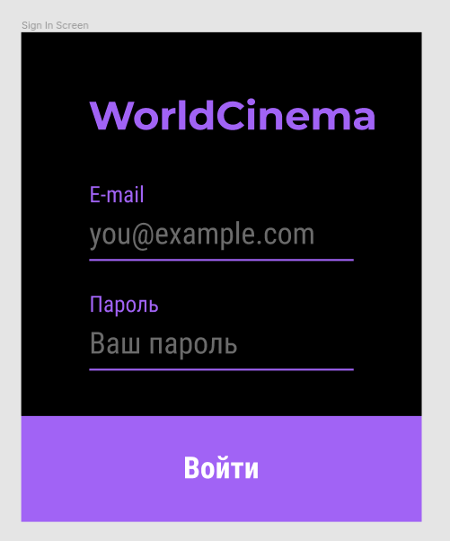

* При нажатии на кнопку "Войти" необходимо проверять поля для ввода на пустоту, а также email на корректность (требования к email описаны в документации к API). При некорректном заполнении необходимо отобразить ошибку с помощью диалогового окна. При корректном заполнении формы необходимо отправить на сервер соответствующий запрос.
* При успешной авторизации необходимо осуществлять переход на экран `Main Screen`. При получении ошибки от сервера необходимо отобразить ее с помощью диалогового окна.

Критерий | Баллы
---------|:----:
Реализован запрос авторизации. Запрос фиксируется сервером | 0.7
Экран соответствует макету (оценивается верстка). Корректно реализованы 4 элемента: логотип, два поля для ввода, кнопка (минус 0,1 за каждый отсутствующий или некорректный элемент) | 0.4
Поля для ввода валидируются на пустоту (минус 0,1 за каждое поле без валидации) | 0.2
При получении ошибки от сервера она отображается с помощью диалогового окна | 0.5
Email проверяется на удовлетворение шаблону из Задания | 0.3
При успешной авторизации открывается экран Main Screen | 0.1
**Итого** | 2.2

### Реализуйте экран Main Screen согласно макету

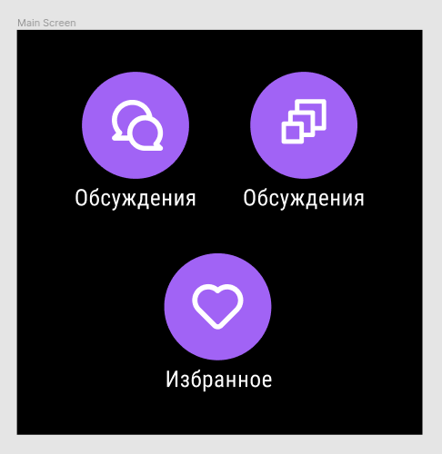

При нажатии на иконку должен осуществляться переход на соответствующий экран. Если экран не описан в Задании - нужно отобразить экран с надписью “В разработке”. При нажатии на кнопку Cancel (для Android - при свайпе вправо) нужно возвращаться на `SignIn Screen`.

Критерий | Баллы
---------|:----:
Экран соответствует макету (оценивается верстка). Корректно реализованы 6 элементов: три кнопки, три надписи (минус 0,1 за каждый отсутствующий или некорректный элемент) | 0.6
При нажатии на иконку осуществляется переход на соответствующий экран (минус 0,1 за каждый отсутствующий переход) | 0.3
При нажатии на кнопку Cancel (на Android - при свайпе вправо) осуществляется возврат на SignIn Screen | 0.1
**Итого** | 1

### Реализуйте экран Chat List Screen согласно макету

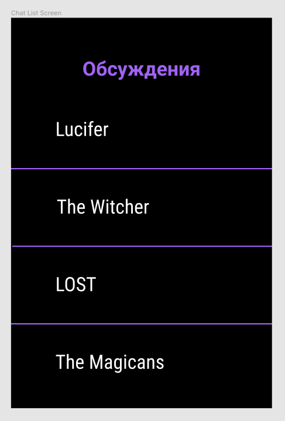

* Данные необходимо запрашивать с сервера. 
* При нажатии на кнопку Cancel (для Android - при свайпе вправо) нужно возвращаться на `Main Screen`.

Критерий | Баллы
---------|:----:
Реализован запрос списка чатов пользователя. Запрос фиксируется сервером | 0.5
Ячейка таблицы соответствует макету | 0.1
**Итого** | 0.6

### Реализуйте экран Movies Screen согласно макету

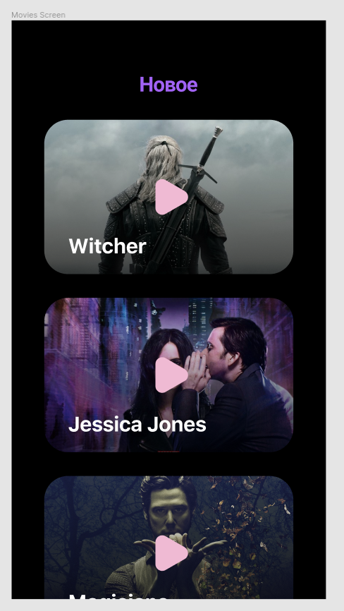

* На данном экране необходимо отобразить фильмы из подборки «new» в виде списка с вертикальной прокруткой. Данные необходимо получать с сервера.

Критерий | Баллы
---------|:----:
Реализован запрос подборки фильмов. Запрос фиксируется сервером | 0.5
Ячейка фильма соответствует макету. Присутствуют
3 элемента: изображение, название, кнопка (минус 0,1 за каждый отсутствующий или некорректный элемент) | 0.3
Список фильмов прокручивается по вертикали | 0.2
**Итого** | 1

## Защита проекта

Критерий | Баллы
---------|:----:
Создана презентация | 0.1
Презентация содержит описание приложения для смартфона | 0.3
Презентация содержит описание приложения для часов | 0.3
**Итого** | 0.7

<table style="width: 100%;"><tr><td style="width: 40%;">
<a href="./android_tv.md">Android TV
</a></td><td style="width: 20%;">
<a href="../readme.md">Содержание
</a></td><td style="width: 40%;">
</a></td><tr></table>
