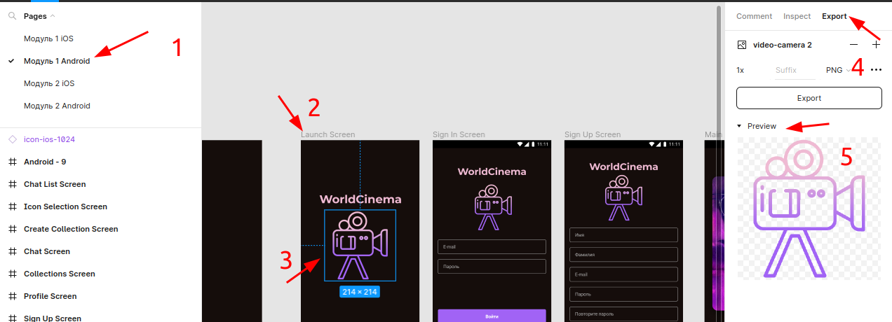
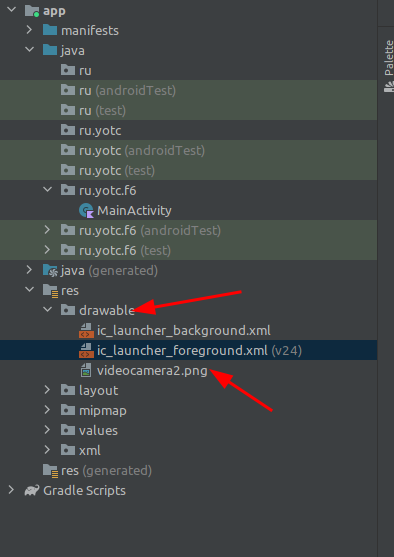
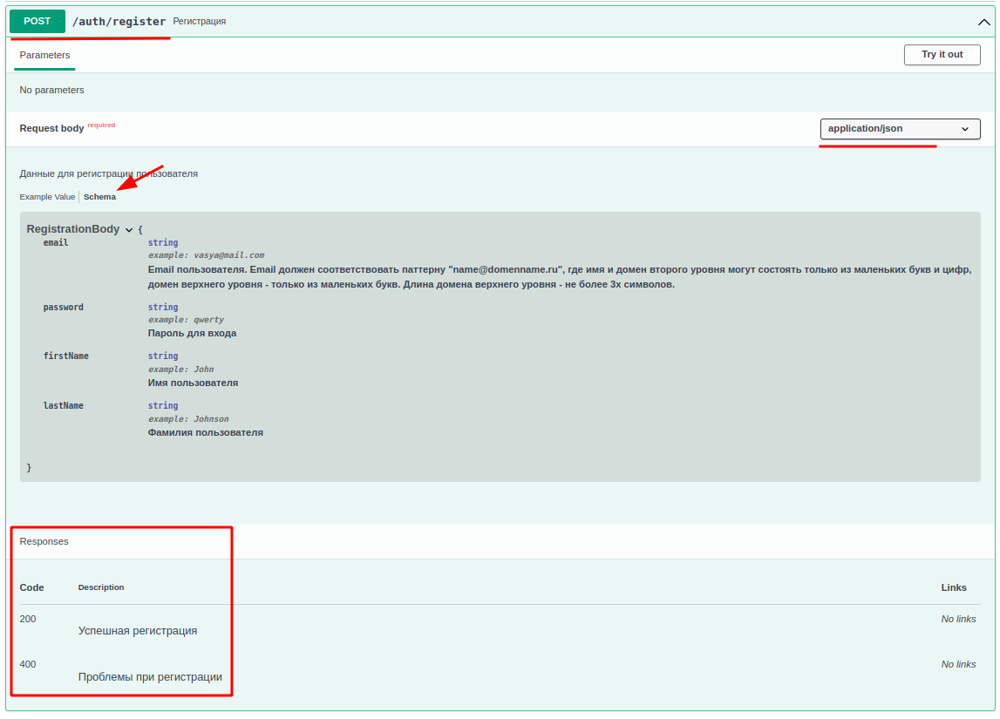
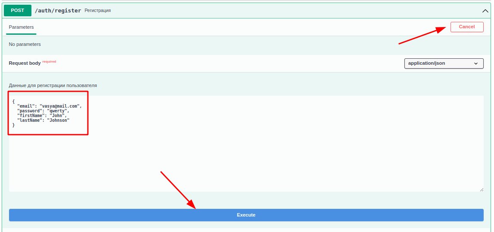
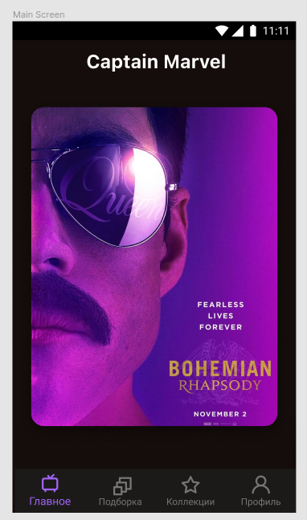

# Разбор заданий прошлых лет

<!-- 
Задание 2021 года, 34 балла (6.8/13.6/23.8)
-->

Задание состоит из 3-х модулей:

* **Модуль 1**  - разработка приложения для смартфона. Основное задание.
    - [Создание проекта](#создание-проекта)
    - [Заставка](#экран-launch-screen)
    - [Экран регистрации](#экран-регистрации)
        - [Валидация полей](#поля-для-ввода-валидируются-на-пустоту)
        - [Swagger](#запрос-регистрации-изучаем-работу-со-swagger)
        - [Регулярные выражения](#email-проверяется-на-удовлетворение-шаблону-из-задания-02-балла)
        - [Сохранение состояния](#при-первом-запуске-приложения-первым-отображается-signup-screen-при-последующих---signin-01-балла)
    - [Экран авторизации](#экран-авторизации)
    - [Главный экран](#главный-экран)

* **Модуль 2**  - разработка приложения для часов (может быть и для телевизора). Коротенькое задание (30 минут). Нужно просто создать приложение из двух окон + работа с интернетом.
* **Модуль 3**  - презентация.

>**Модуль 1**: Смартфоны (разработка мобильного приложения для управления коллекцией фильмов)
>
>Необходимо разработать мобильное приложение для смартфона, удовлетворяющее следующим требованиям:
>
>Приложение должно поддерживать следующие версии ОС:
>   * Android 9.0 и новее
>   * iOS 13.0 и новее

Задание универсальное, мы пишем для Android. Версия задаётся при создании проекта. По-умолчанию там стоит вообще для 5-го андроида. Установите по требованиям ТЗ:


>В работе необходимо использовать систему контроля версий Git.
>
>Для входа используйте учетную запись вида wsX, где X – это номер участника. Необходимо загрузить результаты выполнения модуля в отдельную ветку с именем “Module-X”, где Х – это номер модуля. Для каждого проекта необходим отдельный репозиторий.

Критерий | Баллы
---------|:----:
Создан репозиторий для проекта | 0.25
Создана ветка для мобильного приложения | 0.35
Проект корректно сохранен в ветку для мобильного приложения и не требует дополнительного разархивирования | 0.45
**Итого** | 1.05

1. Название учётной записи будет **userXX**, но об этом я ещё упомяну перед экзаменом (у нас используется готовый сервер **Gogs** с предустановленными пользователями)
2. По веткам:

    *Я бы поменял знак тире на подчёркивание. Не известно как тире в командной строке сработает.*

    **Во-первых**, перед выполнением модуля сразу создайте соответствующий репозиторий (в этом задании названия репозиториев не оговорено): Module_1, Module_2, Module_3

    **Во-вторых**, создайте в репозитории ветку: `git checkout -b Module_1`

    **В-третьих**, при работе желательно в основной ветке (`Module_Х`) держать только **РАБОЧИЙ** код, чтобы было что оценивать не зависимо от того, на каком месте вы остановились. Для этого создайте ещё одну ветку, например **work** (`git checkout -b work`) и работайте в ней. После отладки какой-то фичи (например, сделали авторизацию) фиксируете изменения, переключаетесь на основную ветку (Module_1), сливаете ветки и заливаете основную ветку в репозиторий. Затем возвращаетесь в ветку **work**:

    * фиксируем изменения в ветке work

        ```
        git add .
        git commit -m "сделал авторизацию"
        ```

    * переключаемся на ветку Module_1

        ```
        git checkout Module_1
        ```

    * сливаем изменения из ветки work (в текущую) и, при желании, пушим на удаленный сервер

        ```
        git merge work
        git push origin Module_1
        ```

    * возвращаемся в рабочую ветку

        ```
        git checkout work
        ```

    итоговая структура репозиториев должна получиться примерно такая:

    * Module_1 (репозиторий)
        - Module_1 (ветка)
    * Module_2 (репозиторий)
        - Module_2 (ветка)
    * Module_3 (репозиторий)
        - Module_3 (ветка)

>Необходимо корректно обрабатывать запросы к серверу. В случае получения ошибки от сервера или отсутствия соединения с сетью Интернет необходимо отобразить соответствующий текст ошибки с помощью диалогового окна.

Тут вам придумывать ничего не надо - в классе **Http** уже есть пример, как перехватывать исключения

>Необходимо строго следовать предложенному дизайну. Макеты приложения доступны по ссылке:
https://www.figma.com/file/tD64TlCMQEqlr8OTv6bW2o/KOD1.4-Variant3?node-id=0%3A1 
>
>~~Во время работы не будет доступа в Интернет,~~ кроме документации и API. Описание протокола API доступно по ссылке: ~~https://app.swaggerhub.com/apis-docs/WorldSkills-MAD/WorldCinema/1.0.0~~ (так как АПИ на момент написания этих лекций не доступно, то я нарисовал своё АПИ и Swagger для него лежит по адресу http://swagger.kolei.ru)

>Проект приложения должен быть структурирован по экранам, то есть исходные файлы конкретного экрана должны быть в соответствующей папке. Общие для нескольких экранов классы необходимо поместить в папку common.

В андроиде нужно делать не папки, а пакеты. Например, создаёте пакет LaunchScreen и в него переносите MainActivity. Для остальных окон сначала делаете пакет, например SignUpScreen, затем в этом пакете создаёте SignUpActivity.

Критерий | Баллы
---------|:----:
Проект приложения для смартфона имеет корректную структуру (все файлы распределены по папкам, соответствующим экранам приложения) | 0.5

## Создание проекта

>Необходимо реализовать следующий функционал:
>
>1. Создайте проект. Настройте иконку приложения согласно макету. Следует учесть разницу в отображении иконок на различных версиях операционной системы.

Критерий | Баллы
---------|:----:
Создан проект мобильного приложения | 0.1
Проект мобильного приложения успешно собирается | 0.1
Иконка приложения соответствует Заданию | 0.2

Про создание иконок смотри [первичную настройку приложения](./android_auth.md#первичная-настройка-приложения)

В этом задании используется тёмная тема. Для переключения в ночной режим в конструктор каждого окна добавить код.

```kt
AppCompatDelegate.setDefaultNightMode(AppCompatDelegate.MODE_NIGHT_YES)
```

Все графические ресурсы для приложения вы должны загрузить из "фигмы", про неё расписано в разделе [Экран Launch Screen](#экран-launch-screen)

## Экран Launch Screen

>2. Реализуйте экран Launch Screen согласно макету. Текст должен быть отдельным элементом. Логотип приложения должен быть расположен по центру экрана.

Критерий | Баллы
---------|:----:
Текст на Launch Screen является отдельным элементом | 0.1
Логотип на Launch Screen отцентрирован | 0.1

Как пользоваться "фигмой" для получения ресурсов:



1. Убедитесь, что смотрите правильный вариант вёрстки (нам нужен Андроид, Модуль 1)
2. Экраны подписаны - нам нужен Launch Screen
3. Выбираем элемент, который хотим экспортировать, например, логотип
4. В правой панели выберите закладку **Export**
5. Окройте **Preview** и убедитесь что элемент выбран весь целиком
6. Убедитесь, что формат для экспорта **PNG** и жмите **кнопку** Export

Браузер сохранит файл с тем же названием, что и у элемента вёрстки (`video-camera 2.png`). Переименуйте его, убрав пробелы, чёрточки и любую другую фигню, которая может помешать воспринимать ресурс по имени (оставьте только латинские буквы и цифры). Ещё, как выяснилось на практике, ресурсы не могут быть в CamelCase, при именовании не используйте большие буквы.

Перенесите (drag-n-drop) полученный файл в ресурс drawable проекта



в шаблон главного окна (`activity_main.xml`) добавьте элемент **ImageView** и отцентрируйте его горизонтально и вертикально (на этом окне можно не извращаться и не добавлять **LinearLayout**)


Аналогично экспортируйте и внедрите в ресурсы картинку с текстом *WorldCinema*.

Нигде в задании не сказано, как переходить на окно авторизации - добавьте таймер на несколько секунд, чтобы экперты успели рассмотреть вёрстку, и [переходите на следующее окно](../shpora/startActivity.md#таймер-обратного-отсчёта-и-переход-на-другое-activity)

## Экран регистрации


>3. Реализуйте экран SignUp Screen согласно макету:
>   * При нажатии на кнопку "Зарегистрироваться" необходимо проверять поля для ввода на пустоту, а также email на корректность (требования к email описаны в документации к API). При некорректном заполнении необходимо отобразить ошибку с помощью диалогового окна. Так же необходимо проверять равенство пароля и его повтора.
>   * При корректном заполнении формы необходимо отправлять запрос регистрации на сервер. При получении ошибки от сервера ее необходимо отобразить с помощью диалогового окна. При успешной регистрации нужно автоматически осуществить авторизацию и перейти на Main Screen.
>   * При нажатии на кнопку "У меня уже есть аккаунт" необходимо осуществлять переход на SignIn Screen.
>   * При первом запуске приложения после Launch Screen должен отображаться SignUp Screen. При последующих - SignIn Screen.

Критерий | Баллы
---------|:----:
Реализован запрос регистрации. Запрос фиксируется сервером | 0.7
Экран соответствует макету (оценивается верстка). Корректно реализованы 9 элементов: логотип, название, 5 текстовых полей, 2 кнопки (минус 0,1 за каждый отсутствующий или некорректный элемент) | 0.9
Поля для ввода валидируются на пустоту (минус 0,1 за каждое поле без валидации) | 0.5
Пароль и его повтор проверяются на равенство | 0.1
При получении ошибки от сервера она отображается с помощью диалогового окна | 0.3
Email проверяется на удовлетворение шаблону из Задания | 0.2
При первом запуске приложения первым отображается SignUp Screen, при последующих - SignIn | 0.1
**Итого** | **2.8**

Тут уже можно завернуть всё в **LinearLayout**

### Поля для ввода валидируются на пустоту

Можно было бы использовать [специальный компонент](http://developer.alexanderklimov.ru/android/layout/textinputlayout.php) с маской ввода, но в задании сказано что валидация делается вручную при клике на кнопку "Зарегистрироваться". Пример ниже:

```kt
// обратите внимание на наименование переменных: самоочевидное название + тип элемента
lateinit var nameEditText: EditText
lateinit var signUpButton: Button

override fun onCreate(savedInstanceState: Bundle?) {
    super.onCreate(savedInstanceState)
    setContentView(R.layout.activity_main)

    // не забываем инициализировать ссылки на визуальные элементы
    nameEditText = findViewById(R.id.nameEditText)
    signUpButton = findViewById(R.id.signUpButton)

    signUpButton.setOnClickListener {
        try {
            if (nameEditText.text.isEmpty())
                throw Exception("Не заполнено имя пользователя")
            
            тут остальные проверки
            
            тут отправка запроса регистрации

        } catch (e: Exception) {
            // любую ошибку показываем на экране
            AlertDialog.Builder(this)
                .setTitle("Ошибка")
                .setMessage(e.message)
                .setPositiveButton("OK", null)
                .create()
                .show()
        }
    }
}
```

### Запрос регистрации (изучаем работу со Swagger)

**Swagger** - это фреймворк для спецификации *RESTful API*. Его прелесть заключается в том, что он дает возможность не только интерактивно просматривать спецификацию, но и отправлять запросы.

Открываем [ссылку](http://swagger.kolei.ru) на описание протокола АПИ и смотрим что там есть:


В начале идёт общая информация. Нам тут пока интереснен только так называемый базовый URL. Здесь он находится в блоке Servers (`http://cinema.areas.su`), но может быть написан и просто текстом (как базовые урлы для картинок и видео).

**ВАЖНО!!!** *figma* и *swagger* на момент написания этой лекции работают, а вот сервер АПИ - нет, видимо его запускали только на время работы демо-экзамена. Я написал простенький симулятор этого сервера, он доступен по адресу `http://cinema.kolei.ru`, реализованные методы описаны в [файле cinema/api.rest](../cinema/api.rest) этого репозитория.

Дальше идут описания методов АПИ. Рассмотрим подробно метод Регистрация:



1. В заголовке указано какой метод и "путь" используются для запроса. К пути надо добавить "базовый урл" и получим полный адрес запроса: `http://cinema.areas.su/auth/register`

1. В параметрах (Parameters) указываются параметры GET-запросов, передаваемые в строке запроса. У нас тут пусто.

1. Тело запроса (Request body). Тут указано что тело запроса обязательно должно присутсвовать (required) и формат `application/json`

    В теле запроса должна быть JSON-строка. Пример её можно посмотреть на вкладке **Example value**, но нам интереснее вкладка **schema** - на ней описаны типы данных (string), описание поля (что это такое вообще) и, возможно, обязательность использования поля. Например, для поля **email** расписан шаблон, которому оно должно соответсвовать.

1. Коды ответов (Responses)

    Тут надо быть внимательным, коды могут отличаться.

Ну и самое приятное в Swagger - можно прямо в нём проверить результат работы. Кликаем кнопку "Try it out", вводим в открывшемся окне тело запроса и нажимаем выполнить (Execute). Таким образом нам не нужны ни **Postman** ни **VSCode** с плагинами



Пример отправки запроса я не привожу - вы уже должны написать его самостоятельно.

### Email проверяется на удовлетворение шаблону из Задания (0.2 балла)

Такая проверка делается с помощью регулярных выражений. Например:

`^[a-z0-9]+@[a-z0-9]+\.[a-z]{1,3}$`

>В задании сказано, что имя и домен второго уровня должны содержать только маленькие буквы и цифры. 

* знак `^` означает "начало строки"
* Диапазон значений указывается в квадратных скобках. 
* Количество символов указывается после диапазона (`+` означает 1 и более)
* знак `@` пишем как есть
* точка является зарезервированным символом регулярных выражений (означает "любой символ"), поэтому её экранируем (перед точкой пишем обратный слеш)
* домен первого уровня должен содержать не более 3-х **букв** - задаем количество в фигурных скобках (от 1 до 3) и оставляем только буквы
* знак `$` означает "конец строки"

Пример проверки электронной почты:

```kt
val re = Regex("""^[a-z0-9]+@[a-z0-9]+\.[a-z]{1,3}$""")
val res = re.find(emailEditText.text.ToString())
// если регулярное выражение ничего не найдет, то вернёт null
if(res == null)
    throw Exception("Электронная почта не соответствует шаблону")
```

### При первом запуске приложения первым отображается SignUp Screen, при последующих - SignIn (0.1 балла)

Для того чтобы узнать первый запуск или нет, нужно сохранить этот признак в постоянное хранилище. Пример работы с хранилищем есть в [шпаргалке](../shpora/preferences.md). Попробуйте разобраться самостоятельно.

## Экран авторизации


>4. Реализуйте экран SignIn Screen согласно макету:
>   * При нажатии на кнопку "Войти" необходимо проверять поля для ввода на пустоту, а также email на корректность (требования к email описаны в документации к API). При некорректном заполнении необходимо отобразить ошибку с помощью диалогового окна. При корректном заполнении формы необходимо отправить на сервер соответствующий запрос.
>   * При нажатии на кнопку "Регистрация" необходимо осуществлять переход на SignUp Screen.
>   * При успешной авторизации необходимо осуществлять переход на экран Main Screen. При получении ошибки от сервера необходимо отобразить ее с помощью диалогового окна.

Критерий | Баллы
---------|:----:
Реализован запрос авторизации. Запрос фиксируется
сервером | 0.7
При получении ошибки от сервера она отображается
с помощью диалогового окна | 0.3
Экран соответствует макету (оценивается верстка). Корректно реализованы 6 элементов: логотип, название, 2 текстовых поля, 2 кнопки (минус 0,1 за каждый отсутствующий или некорректный элемент) | 0.6
Поля для ввода валидируются на пустоту (минус 0,1 за каждое поле без валидации) | 0.2
Email проверяется на удовлетворение шаблону из
Задания | 0.3
**Итого** | **2.1**

Тут просто копипастите предыдущий экран, удалив лишнее, ничего нового.

Запрос тоже практически идентичный предыдущему, расписывать не буду.

Не забудьте сохранить полученный токен в [классе приложения](../shpora/%D1%85%D1%80%D0%B0%D0%BD%D0%B5%D0%BD%D0%B8%D0%B5%20%D0%B3%D0%BB%D0%BE%D0%B1%D0%B0%D0%BB%D1%8C%D0%BD%D1%8B%D1%85%20%D0%BF%D0%B5%D1%80%D0%B5%D0%BC%D0%B5%D0%BD%D0%BD%D1%8B%D1%85%20%D0%B2%20%D0%BA%D0%BB%D0%B0%D1%81%D1%81%D0%B5%20%D0%BF%D1%80%D0%B8%D0%BB%D0%BE%D0%B6%D0%B5%D0%BD%D0%B8%D1%8F.md) (и в предыдущем окне тоже)

## Главный экран



>5. Реализуйте экран Main Screen согласно макету:
>   * На экране необходимо отобразить обложки фильмов из подборки «new» (информацию о фильмах необходимо запрашивать с сервера). Обложки должны быть отображены в виде карусели, необходимо реализовать возможность пролистывания с помощью жеста swipe.
>   * При пролистывании обложек название фильма в верхней части экрана должно меняться.
>   * При нажатии на обложку необходимо переходить на Chat Screen для соответствующего фильма.

Критерий | Баллы
---------|:----:
Реализован запрос подборки фильмов. Запрос фиксируется сервером | 0.5
Обложки пролистываются с помощью swipe | 0.5
Обложка фильма отображается с закругленными углами | 0.3
При нажатии на обложку осуществляется переход на экран чата соответствующего фильма | 0.1
**Итого** | **1.4**

### Запрос подборки фильмов

В АПИ много лишних методов - ищете метод, который подходит по смыслу:

`GET /movies Получить список фильмов`

Так как метод запроса **GET**, то тела запроса (*body*) у него нет, но зато есть параметры запроса (*Parameters*), причём параметры эти обязательны (required).

Нам по заданию нужно отобразить новые (new), поэтому итоговый URL запроса будет такой:

`http://cinema.kolei.ru/movies?filter=new`

где:

- `http://cinema.kolei.ru` - базовый URL
- `/movies` - путь (*path*) запроса
- `?` - разделитель полного URL запроса и списка параметров
- `filter=new` - параметры запроса в формате `имя=значение`. Если необходимо передать несколько параметров, то они разделяются знаком `&`. Например: `?param1=one&param2=two`

Формат ответа - массив информации о фильмах. Нам, судя по вёрстке, нужны пока только название фильма (*name*) и обложка (*poster*). И, скорее всего, идентификатор (*movieId*), чтобы указать его в следующих запросах.

Для вывода списка фильмов используйте компонент **RecyclerView** (направление пролистывания не указано, так что делайте как вам больше нравится)

>6. Реализуйте экран Profile Screen согласно макету:
>   * Данные о пользователе необходимо запрашивать с сервера.
>   * При нажатии на кнопку "Изменить" необходимо реализовать изменение аватара пользователя: 
>       - Пользователь выбирает источник фотографии (камера или Галерея), выбор источника следует реализовать с помощью диалогового окна. При выборе Галереи необходимо открывать Галерею. При выборе камеры осуществлять переход на экран Камеры не нужно.
>       - Пользователь выбирает фотографию. 
>       - Фотография отправляется на сервер.
>       - В случае успеха аватар пользователя заменяется на новый, в случае ошибки она отображается с помощью диалогового окна.
>   * При нажатии на кнопку "Выход" необходимо осуществлять переход на экран авторизации. 
>   * При нажатии на кнопку «Обсуждения» необходимо переходить на соответствующий экран.

>7. Реализуйте экран Chat List Screen согласно макету:
>   * Информацию необходимо запрашивать с сервера (запрос чатов пользователя). Если информация с сервера содержит дубляжи – их необходимо удалить. Если ваш пользователь еще не имеет чатов, сервер присылает пустой список, отправьте сообщение от текущего пользователя в чате с id = 1 с помощью Swagger или Postman.
>   * В подзаголовке ячейки необходимо отобразить последнее сообщение в соответствующем чате + имя его автора. Текст сообщения необходимо обрезать до двух строк.
>   * Реализуйте отображение постеров к фильмам. Для получения постеров используйте подходящий запрос из API. Если постер для данного фильма нельзя получить из API - сгенерируйте абревиатуру по следующему правилу: если название фильма состоит и одного слова - необходимо взять первые две буквы слова; иначе - первые буквы первого и второго слова.
>   * При нажатии на ячейку необходимо осуществлять переход на Chat Screen для выбранного фильма.

>8. Реализуйте экран Chat Screen согласно макету:
>   * Сообщения необходимо упорядочить от старых к новым сверху вниз. Для сегодняшних сообщений необходимо отобразить заголовок "Сегодня".
>   * "Облако" сообщения должно растягиваться по содержимому.
>   * Последовательно идущие сообщения одного автора необходимо группировать (расстояния между сообщениями должны быть меньше, как на макете).
>   * Реализуйте блок отправки сообщения как на макете. При вводе сообщения поле для ввода должно растягиваться по вертикали.
>   * При нажатии на кнопку "Отправить" необходимо отправить сообщение на сервер. При позитивном ответе от сервера необходимо отобразить сообщение в чате. При возникновении ошибки - отобразить ошибку с помощью диалогового окна.
>   * Необходимо валидировать поле для ввода на пустоту. При отсутствии текста сообщения необходимо отобразить ошибку с помощью диалогового окна.

>9. Реализуйте экран Collections Screen согласно макету:
>   * При нажатии на иконку в правом верхнем углу необходимо переходить на экран Create Collection Screen.
>   * На экране необходимо отображать созданные коллекции. Информация о коллекциях должна храниться в памяти устройства. Необходимо хранить название коллекции и иконку.
>   * Реализуйте Swipe-to-delete для удаления коллекции, в том числе из памяти устройства.

>10. Реализуйте экран Create Collection Screen согласно макету:
>   * При открытии экрана в качестве иконки должно быть выбрано случайное изображение из коллекции иконок.
>   * При нажатии на кнопку "Выбрать иконку" необходимо осуществлять переход на экран Icon Selection. Реализуйте данный экран в соответствии с макетом.
>   * При нажатии на кнопку "Сохранить" необходимо сохранить новую коллекцию в памяти устройства и закрыть экран.
>   * Необходимо проверять на пустоту поле для ввода названия коллекции. При отсутствии значения необходимо отобразить сообщение об ошибке.

