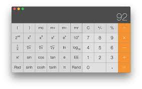
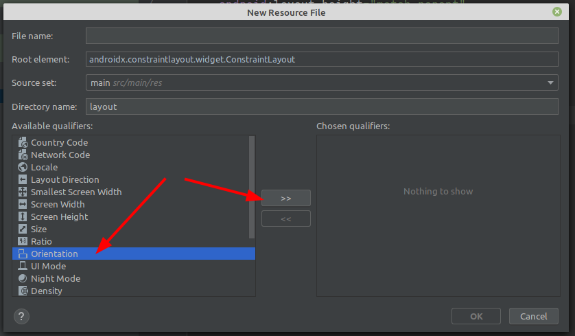

<table style="width: 100%;"><tr><td style="width: 40%;">
<a href="../articles/themes.md">Стили и темы. Ресурсы. Фигуры. Обработчики событий.
</a></td><td style="width: 20%;">
<a href="../readme.md">Содержание
</a></td><td style="width: 40%;">
<a href="../articles/weather.md">Проект погода (начало): геолокация, http(s)-запросы, разбор json, ImageView.
</a></td><tr></table>

# Ориентация экрана

>Взято [отсюда](http://developer.alexanderklimov.ru/android/orientation.php#whereorientation)

При разработке мобильных приложений со сложным дизайном нередки ситуации, когда при изменении ориентации экрана все выглядит совсем не так, как Вам хотелось бы. В таких случаях выходом из ситуации может стать использование различных шаблонов для книжной и альбомной ориентации устройства. При этом переключение между шаблонами может осуществляться в автоматическом или динамическом (ручном) режиме.

Для автоматического режима достаточно создать дополнительнай файл шаблона для альбомной ориентации.

Создадим дополнительный шаблон с "инженерной" версией калькулятора:

Для этого добавим **одноименный** шаблон, указав ему ориентацию:

**Android Studio** автоматически создаст каталог `layout-land` и сохранит туда новый шаблон.

Когда вы создаёте альтернативную разметку, то не забывайте проверять наличие элементов, к которым будете обращаться программно, иначе получите ошибку.

<table style="width: 100%;"><tr><td style="width: 40%;">
<a href="../articles/themes.md">Стили и темы. Ресурсы. Фигуры. Обработчики событий.
</a></td><td style="width: 20%;">
<a href="../readme.md">Содержание
</a></td><td style="width: 40%;">
<a href="../articles/weather.md">Проект погода (начало): геолокация, http(s)-запросы, разбор json, ImageView.
</a></td><tr></table>
