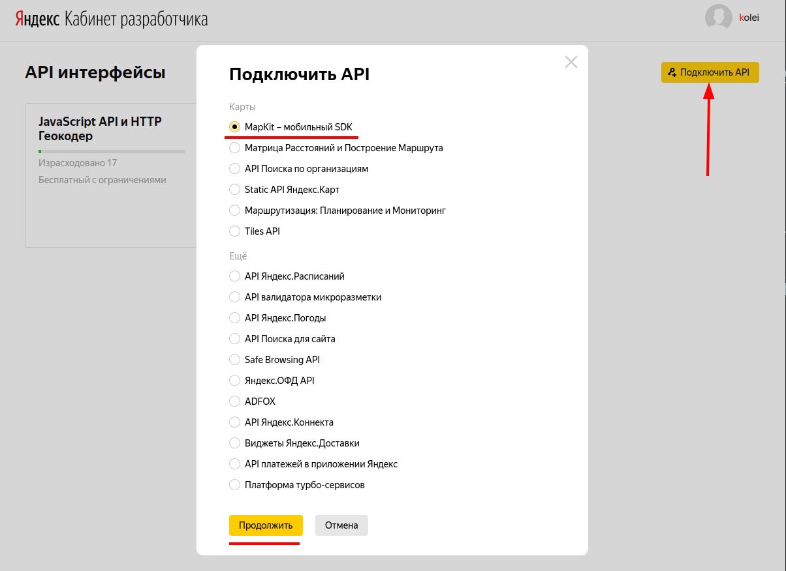

<table style="width: 100%;"><tr><td style="width: 40%;">
<a href="../articles/android_auth.md">Проект "база". Авторизация на сервере (Basic auth, token)
</a></td><td style="width: 20%;">
<a href="../readme.md">Содержание
</a></td><td style="width: 40%;">
<a href="../articles/wear_os.md">Wear OS
</a></td><tr></table>

# Работа с картами

>Этот вариант написан для [Яндекс.карт](https://yandex.ru/dev/maps/mapkit/doc/intro/concepts/about.html?from=mapkit)

>Описание протокола API доступно по ссылке:
>http://swagger.kolei.ru/?url=http://carsharing.kolei.ru/swagger/api.yml

### Шаг 1. Получите ключ для работы с MapKit

Переходим по [ссылке](https://developer.tech.yandex.ru/services/) (если у вас нет аккаунта yandex, то нужно сделать)

Нажмите "Подключить API" и выберите пакет "MapKit - мобильный SDK".



Заполните форму


В итоге у вас будет ключ


### Шаг 2. Установите библиотеку MapKit

Создайте проект, откройте `build.gradle` **проекта**, В секции `buildscript/repositories` добавьте репозитории **Maven Central** и **Google Maven** (этот блок должен быть ДО секции `plugins`):

```txt
buildscript {
    repositories {
        mavenCentral()
        maven {
            url "https://maven.google.com/"
        }
    }
}
```

Откройте файл `build.gradle` приложения (модуля). В секции *dependencies* добавьте зависимость:

```txt
implementation 'com.yandex.android:maps.mobile:4.2.2-lite'
```

### Шаг 3. Настройте библиотеку

1. Добавьте карту на Activity (создайте активность для карты, если её ещё нет):

    ```xml
    <com.yandex.mapkit.mapview.MapView
        android:id="@+id/mapview"
        android:layout_width="match_parent"
        android:layout_height="match_parent"/>
    ```

1. Установите ваш API-ключ в методе *onCreate()* вашего наследника **Application** (судя по названию класса это должен быть наш класс MyApp, но я устанавливаю ключ в активности с картой):

    ```kt
    private lateinit var mapView: MapView  

    override fun onCreate(savedInstanceState: Bundle?) {
        super.onCreate(savedInstanceState)

        MapKitFactory.setApiKey( !!!ТУТ ВАШ КЛЮЧ!!! )
    ```

1. Инициализируйте карту в методе *onCreate()* нужного **Activity**:

    **Внимание!!! Инициализацию нужно делать до вызова *setContentView***

    ```kt
    MapKitFactory.setApiKey(apiKey!!)

    MapKitFactory.initialize(this)

    setContentView(R.layout.activity_main)

    // получение указателя на визуальный элемент "карта"
    mapView = findViewById(R.id.mapview)

    // перемещение камеры в нужную точку
    mapView.map.move(
        CameraPosition(
            Point(55.751574, 37.573856),
            18.0f,  // зум
            0.0f, 
            0.0f
        ),
        Animation(Animation.Type.SMOOTH, 0f),
        null
    )
    ```

1. Передайте события *onStart* и *onStop* в **MapKitFactory** и **MapView**. Иначе **MapKit** не сможет отобразить карту и остановить обработку карты, когда **Activity** с картой становится невидимым для пользователя:

    ```kt
    override fun onStart() {
        super.onStart()
        MapKitFactory.getInstance().onStart()
        mapView.onStart()
    }

    override fun onStop() {
        mapView.onStop()
        MapKitFactory.getInstance().onStop()
        super.onStop()
    }
    ```

На этом этапе приложение уже должно нормально запускаться и показывать карту где-то в реке Москве

### Добавление маркеров на карту

У яндекс карт, насколько я понял, нет стандарного значка для маркера текущей локации, все маркеры делаются одинаково из картинок (есть варианты и из фигур, но их рассматривать не будем). Добавьте в ресурсы приложения картинку для маркера текущей локации (в каталог `res/drawable`) и создайте маркер (в конструкторе, после камеры):

```kt
val imageProvider: ImageProvider = ImageProvider
    .fromResource(
        this, 
        R.drawable.location_marker)

mapView
    .map
        .mapObjects
            .addPlacemark(
                Point(
                    55.751574, 
                    37.573856),
                imageProvider)
```

### Отображение детальной информации об объекте

В яндекс картах я не нашёл аналога **InformationWindow** - окна, появляющегося при клике на маркер у гугла. Реализуем показ обычными визуальными элементами:

1. Добавьте в разметку окна **LinearLayout** с необходимым содержимым. Задайте ему атрибут `visibility="gone"` (не показывать и не занимать место)

1. В свойствах класса окна добавьте массив для созданных маркеров и указатель на обработчик клика (тапа) по маркеру:

    ```kt
    private var markerList = ArrayList<PlacemarkMapObject>()

    private var markerTapListener: MapObjectTapListener? = null
    ```

1. В класс добавьте методы для задания обработчика и для добавления маркера:

    ```kt
    private fun setTapListener(listener: MapObjectTapListener) {
        markerTapListener = listener
    }

    private fun addMarker(
        latitude: Double,
        longitude: Double,
        @DrawableRes imageRes: Int,
        userData: Any? = null
    ): PlacemarkMapObject 
    {
        val marker = mapView.map.mapObjects
            .addPlacemark(
                Point(latitude, longitude),
                ImageProvider
                    .fromResource(
                        this, 
                        imageRes)
        )
        marker.userData = userData
        markerTapListener?.let{ 
            marker
                .addTapListener(it) }
        return marker
    }
    ```

1. Задайте обработчик клика. Добавьте маркер на карту (в примере добавляется один в конструкторе, но вы получаете их из интернета, запросив список автомобилей)

    ```kt
    setTapListener { mapObject, point ->
        detailInfo.visibility = View.VISIBLE
        // тут задайте информацию о маркере (фото, модель...)
        // mapObject.userData содержит экземпляр Car, который вы задали при создании маркера
        true
    }

    // создайте экземпляр информации об автомобиле
    val car = Car(...)

    markerList.add(
        addMarker(
            lat, 
            lon,
            R.drawable.car, 
            car
        )
    )
    ```
